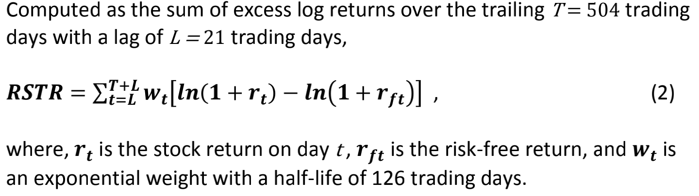

# Anomaly

This is an introduction to all anomalies included in the FactorMaster project.

## Name Convention
All anomalies must be named in **ONE** word without **BLANK SPACES** or **UNDERSCORES**. However, a "long" word such as "MyFactor1" is allowed (and preferred).

An anomaly can have multiple sub-anomalies which are formatted with different schemes, in which case, a sub-type number should be assigned to each sub-anomalies. The final name will be like "MyFactor1_0" and "MyFactor1_1"

## Overviews

| Category | Name | Suffix | Description | Schemes |
| -------- | ---- | ------ | ----------- | ------- |
| Beta    | BrrBeta | &nbsp; | Sub-Type 第1位表示样本大小, 第2位表示调仓频率, 第3位表示行业中性方法, 第4位表示市值中性方法 | 选取所有样本内股票, 选择用超额收益(return - risk free rate)对CAPM模型中市场收益做回归得到的系数作为feature(选择252天回看长度, 63天半衰期的指数平均), 用行业中性方法做相应处理, 在每个调仓日按照feature从小到大排序, 分成10组, 做多第10组, 做空第1组, 按照市值中性方法进行等权或市值加权 |
| &nbsp; | &nbsp; | 0000 | 样本空间: ASHARE-TRADE 调仓频率: 月频 行业中性方法: 不做行业中性 市值中性方法:不做市值中性| &nbsp; |
| &nbsp; | &nbsp; | 0001 | 样本空间: ASHARE-TRADE 调仓频率: 月频 行业中性方法: 不做行业中性 市值中性方法:市值中性| &nbsp; |
| &nbsp; | &nbsp; | 0100 | 样本空间: ASHARE-TRADE 调仓频率: 周频 行业中性方法: 不做行业中性 市值中性方法:不做市值中性| &nbsp; |
| &nbsp; | &nbsp; | 0101 | 样本空间: ASHARE-TRADE 调仓频率: 周频 行业中性方法: 不做行业中性 市值中性方法:市值中性| &nbsp; |
| &nbsp; | &nbsp; | 0010 | 样本空间: ASHARE-TRADE 调仓频率: 月频 行业中性方法: 用Regression做行业中性 市值中性方法:不做市值中性| &nbsp; |
| &nbsp; | &nbsp; | 0011 | 样本空间: ASHARE-TRADE 调仓频率: 月频 行业中性方法: 用Regression做行业中性 市值中性方法:市值中性| &nbsp; |
| &nbsp; | &nbsp; | 0110 | 样本空间: ASHARE-TRADE 调仓频率: 周频 行业中性方法: 用Regression做行业中性 市值中性方法:不做市值中性| &nbsp; |
| &nbsp; | &nbsp; | 0111 | 样本空间: ASHARE-TRADE 调仓频率: 周频 行业中性方法: 用Regression做行业中性 市值中性方法:市值中性| &nbsp; |
| Growth    | BrrEGRO | &nbsp; | Sub-Type 第1位表示样本大小, 第2位表示调仓频率, 第3位表示行业中性方法, 第4位表示市值中性方法 | 选取所有样本内股票, 选择feature参考(财报数据均取**保守**值), 用行业中性方法做相应处理, 在每个调仓日按照feature从小到大排序, 分成10组, 做多第10组, 做空第1组, 按照市值中性方法进行等权或市值加权 |
| &nbsp; | &nbsp; | 0000 | 样本空间: ASHARE-TRADE 调仓频率: 月频 行业中性方法: 不做行业中性 市值中性方法:不做市值中性| &nbsp; |
| &nbsp; | &nbsp; | 0001 | 样本空间: ASHARE-TRADE 调仓频率: 月频 行业中性方法: 不做行业中性 市值中性方法:市值中性| &nbsp; |
| &nbsp; | &nbsp; | 0100 | 样本空间: ASHARE-TRADE 调仓频率: 周频 行业中性方法: 不做行业中性 市值中性方法:不做市值中性| &nbsp; |
| &nbsp; | &nbsp; | 0101 | 样本空间: ASHARE-TRADE 调仓频率: 周频 行业中性方法: 不做行业中性 市值中性方法:市值中性| &nbsp; |
| &nbsp; | &nbsp; | 0010 | 样本空间: ASHARE-TRADE 调仓频率: 月频 行业中性方法: 用Regression做行业中性 市值中性方法:不做市值中性| &nbsp; |
| &nbsp; | &nbsp; | 0011 | 样本空间: ASHARE-TRADE 调仓频率: 月频 行业中性方法: 用Regression做行业中性 市值中性方法:市值中性| &nbsp; |
| &nbsp; | &nbsp; | 0110 | 样本空间: ASHARE-TRADE 调仓频率: 周频 行业中性方法: 用Regression做行业中性 市值中性方法:不做市值中性| &nbsp; |
| &nbsp; | &nbsp; | 0111 | 样本空间: ASHARE-TRADE 调仓频率: 周频 行业中性方法: 用Regression做行业中性 市值中性方法:市值中性| &nbsp; |
| Growth    | BrrSGRO | &nbsp; | Sub-Type 第1位表示样本大小, 第2位表示调仓频率, 第3位表示行业中性方法, 第4位表示市值中性方法 | 选取所有样本内股票, 选择feature参考(财报数据均取**保守**值), 用行业中性方法做相应处理, 在每个调仓日按照feature从小到大排序, 分成10组, 做多第10组, 做空第1组, 按照市值中性方法进行等权或市值加权 |
| &nbsp; | &nbsp; | 0000 | 样本空间: ASHARE-TRADE 调仓频率: 月频 行业中性方法: 不做行业中性 市值中性方法:不做市值中性| &nbsp; |
| &nbsp; | &nbsp; | 0001 | 样本空间: ASHARE-TRADE 调仓频率: 月频 行业中性方法: 不做行业中性 市值中性方法:市值中性| &nbsp; |
| &nbsp; | &nbsp; | 0100 | 样本空间: ASHARE-TRADE 调仓频率: 周频 行业中性方法: 不做行业中性 市值中性方法:不做市值中性| &nbsp; |
| &nbsp; | &nbsp; | 0101 | 样本空间: ASHARE-TRADE 调仓频率: 周频 行业中性方法: 不做行业中性 市值中性方法:市值中性| &nbsp; |
| &nbsp; | &nbsp; | 0010 | 样本空间: ASHARE-TRADE 调仓频率: 月频 行业中性方法: 用Regression做行业中性 市值中性方法:不做市值中性| &nbsp; |
| &nbsp; | &nbsp; | 0011 | 样本空间: ASHARE-TRADE 调仓频率: 月频 行业中性方法: 用Regression做行业中性 市值中性方法:市值中性| &nbsp; |
| &nbsp; | &nbsp; | 0110 | 样本空间: ASHARE-TRADE 调仓频率: 周频 行业中性方法: 用Regression做行业中性 市值中性方法:不做市值中性| &nbsp; |
| &nbsp; | &nbsp; | 0111 | 样本空间: ASHARE-TRADE 调仓频率: 周频 行业中性方法: 用Regression做行业中性 市值中性方法:市值中性| &nbsp; |
| Growth    | NIGrowthQoQ | &nbsp; | Sub-Type 第1位表示样本大小, 第2位表示调仓频率, 第3位表示行业中性方法, 第4位表示市值中性方法 | 选取所有样本内股票, 选择Net Income QoQ 比率作为feature(财报数据均取**保守**值), 用行业中性方法做相应处理, 在每个调仓日按照feature从小到大排序, 分成10组, 做多第10组, 做空第1组, 按照市值中性方法进行等权或市值加权 |
| &nbsp; | &nbsp; | 0000 | 样本空间: ASHARE-TRADE 调仓频率: 月频 行业中性方法: 不做行业中性 市值中性方法:不做市值中性| &nbsp; |
| &nbsp; | &nbsp; | 0001 | 样本空间: ASHARE-TRADE 调仓频率: 月频 行业中性方法: 不做行业中性 市值中性方法:市值中性| &nbsp; |
| &nbsp; | &nbsp; | 0100 | 样本空间: ASHARE-TRADE 调仓频率: 周频 行业中性方法: 不做行业中性 市值中性方法:不做市值中性| &nbsp; |
| &nbsp; | &nbsp; | 0101 | 样本空间: ASHARE-TRADE 调仓频率: 周频 行业中性方法: 不做行业中性 市值中性方法:市值中性| &nbsp; |
| &nbsp; | &nbsp; | 0010 | 样本空间: ASHARE-TRADE 调仓频率: 月频 行业中性方法: 用Regression做行业中性 市值中性方法:不做市值中性| &nbsp; |
| &nbsp; | &nbsp; | 0011 | 样本空间: ASHARE-TRADE 调仓频率: 月频 行业中性方法: 用Regression做行业中性 市值中性方法:市值中性| &nbsp; |
| &nbsp; | &nbsp; | 0110 | 样本空间: ASHARE-TRADE 调仓频率: 周频 行业中性方法: 用Regression做行业中性 市值中性方法:不做市值中性| &nbsp; |
| &nbsp; | &nbsp; | 0111 | 样本空间: ASHARE-TRADE 调仓频率: 周频 行业中性方法: 用Regression做行业中性 市值中性方法:市值中性| &nbsp; |
| Growth    | NIGrowthYoY | &nbsp; | Sub-Type 第1位表示样本大小, 第2位表示调仓频率, 第3位表示行业中性方法, 第4位表示市值中性方法 | 选取所有样本内股票, 选择Net Income YoY 比率作为feature(财报数据均取**保守**值), 用行业中性方法做相应处理, 在每个调仓日按照feature从小到大排序, 分成10组, 做多第10组, 做空第1组, 按照市值中性方法进行等权或市值加权 |
| &nbsp; | &nbsp; | 0000 | 样本空间: ASHARE-TRADE 调仓频率: 月频 行业中性方法: 不做行业中性 市值中性方法:不做市值中性| &nbsp; |
| &nbsp; | &nbsp; | 0001 | 样本空间: ASHARE-TRADE 调仓频率: 月频 行业中性方法: 不做行业中性 市值中性方法:市值中性| &nbsp; |
| &nbsp; | &nbsp; | 0100 | 样本空间: ASHARE-TRADE 调仓频率: 周频 行业中性方法: 不做行业中性 市值中性方法:不做市值中性| &nbsp; |
| &nbsp; | &nbsp; | 0101 | 样本空间: ASHARE-TRADE 调仓频率: 周频 行业中性方法: 不做行业中性 市值中性方法:市值中性| &nbsp; |
| &nbsp; | &nbsp; | 0010 | 样本空间: ASHARE-TRADE 调仓频率: 月频 行业中性方法: 用Regression做行业中性 市值中性方法:不做市值中性| &nbsp; |
| &nbsp; | &nbsp; | 0011 | 样本空间: ASHARE-TRADE 调仓频率: 月频 行业中性方法: 用Regression做行业中性 市值中性方法:市值中性| &nbsp; |
| &nbsp; | &nbsp; | 0110 | 样本空间: ASHARE-TRADE 调仓频率: 周频 行业中性方法: 用Regression做行业中性 市值中性方法:不做市值中性| &nbsp; |
| &nbsp; | &nbsp; | 0111 | 样本空间: ASHARE-TRADE 调仓频率: 周频 行业中性方法: 用Regression做行业中性 市值中性方法:市值中性| &nbsp; |
| Growth    | ORGrowthQoQ | &nbsp; | Sub-Type 第1位表示样本大小, 第2位表示调仓频率, 第3位表示行业中性方法, 第4位表示市值中性方法 | 选取所有样本内股票, 选择 Operating Revenue QoQ 比率作为feature(财报数据均取**保守**值), 用行业中性方法做相应处理, 在每个调仓日按照feature从小到大排序, 分成10组, 做多第10组, 做空第1组, 按照市值中性方法进行等权或市值加权 |
| &nbsp; | &nbsp; | 0000 | 样本空间: ASHARE-TRADE 调仓频率: 月频 行业中性方法: 不做行业中性 市值中性方法:不做市值中性| &nbsp; |
| &nbsp; | &nbsp; | 0001 | 样本空间: ASHARE-TRADE 调仓频率: 月频 行业中性方法: 不做行业中性 市值中性方法:市值中性| &nbsp; |
| &nbsp; | &nbsp; | 0100 | 样本空间: ASHARE-TRADE 调仓频率: 周频 行业中性方法: 不做行业中性 市值中性方法:不做市值中性| &nbsp; |
| &nbsp; | &nbsp; | 0101 | 样本空间: ASHARE-TRADE 调仓频率: 周频 行业中性方法: 不做行业中性 市值中性方法:市值中性| &nbsp; |
| &nbsp; | &nbsp; | 0010 | 样本空间: ASHARE-TRADE 调仓频率: 月频 行业中性方法: 用Regression做行业中性 市值中性方法:不做市值中性| &nbsp; |
| &nbsp; | &nbsp; | 0011 | 样本空间: ASHARE-TRADE 调仓频率: 月频 行业中性方法: 用Regression做行业中性 市值中性方法:市值中性| &nbsp; |
| &nbsp; | &nbsp; | 0110 | 样本空间: ASHARE-TRADE 调仓频率: 周频 行业中性方法: 用Regression做行业中性 市值中性方法:不做市值中性| &nbsp; |
| &nbsp; | &nbsp; | 0111 | 样本空间: ASHARE-TRADE 调仓频率: 周频 行业中性方法: 用Regression做行业中性 市值中性方法:市值中性| &nbsp; |
| Growth    | ORGrowthYoY | &nbsp; | Sub-Type 第1位表示样本大小, 第2位表示调仓频率, 第3位表示行业中性方法, 第4位表示市值中性方法 | 选取所有样本内股票, 选择 Operating Revenue YoY 比率作为feature(财报数据均取**保守**值), 用行业中性方法做相应处理, 在每个调仓日按照feature从小到大排序, 分成10组, 做多第10组, 做空第1组, 按照市值中性方法进行等权或市值加权 |
| &nbsp; | &nbsp; | 0000 | 样本空间: ASHARE-TRADE 调仓频率: 月频 行业中性方法: 不做行业中性 市值中性方法:不做市值中性| &nbsp; |
| &nbsp; | &nbsp; | 0001 | 样本空间: ASHARE-TRADE 调仓频率: 月频 行业中性方法: 不做行业中性 市值中性方法:市值中性| &nbsp; |
| &nbsp; | &nbsp; | 0100 | 样本空间: ASHARE-TRADE 调仓频率: 周频 行业中性方法: 不做行业中性 市值中性方法:不做市值中性| &nbsp; |
| &nbsp; | &nbsp; | 0101 | 样本空间: ASHARE-TRADE 调仓频率: 周频 行业中性方法: 不做行业中性 市值中性方法:市值中性| &nbsp; |
| &nbsp; | &nbsp; | 0010 | 样本空间: ASHARE-TRADE 调仓频率: 月频 行业中性方法: 用Regression做行业中性 市值中性方法:不做市值中性| &nbsp; |
| &nbsp; | &nbsp; | 0011 | 样本空间: ASHARE-TRADE 调仓频率: 月频 行业中性方法: 用Regression做行业中性 市值中性方法:市值中性| &nbsp; |
| &nbsp; | &nbsp; | 0110 | 样本空间: ASHARE-TRADE 调仓频率: 周频 行业中性方法: 用Regression做行业中性 市值中性方法:不做市值中性| &nbsp; |
| &nbsp; | &nbsp; | 0111 | 样本空间: ASHARE-TRADE 调仓频率: 周频 行业中性方法: 用Regression做行业中性 市值中性方法:市值中性| &nbsp; |
| Growth    | OCFGrowthYoY | &nbsp; | Sub-Type 第1位表示样本大小, 第2位表示调仓频率, 第3位表示行业中性方法, 第4位表示市值中性方法 | 选取所有样本内股票, 选择Operating Cash Flow YoY 比率作为feature(财报数据均取**保守**值), 用行业中性方法做相应处理, 在每个调仓日按照feature从小到大排序, 分成10组, 做多第10组, 做空第1组, 按照市值中性方法进行等权或市值加权 |
| &nbsp; | &nbsp; | 0000 | 样本空间: ASHARE-TRADE 调仓频率: 月频 行业中性方法: 不做行业中性 市值中性方法:不做市值中性| &nbsp; |
| &nbsp; | &nbsp; | 0001 | 样本空间: ASHARE-TRADE 调仓频率: 月频 行业中性方法: 不做行业中性 市值中性方法:市值中性| &nbsp; |
| &nbsp; | &nbsp; | 0100 | 样本空间: ASHARE-TRADE 调仓频率: 周频 行业中性方法: 不做行业中性 市值中性方法:不做市值中性| &nbsp; |
| &nbsp; | &nbsp; | 0101 | 样本空间: ASHARE-TRADE 调仓频率: 周频 行业中性方法: 不做行业中性 市值中性方法:市值中性| &nbsp; |
| &nbsp; | &nbsp; | 0010 | 样本空间: ASHARE-TRADE 调仓频率: 月频 行业中性方法: 用Regression做行业中性 市值中性方法:不做市值中性| &nbsp; |
| &nbsp; | &nbsp; | 0011 | 样本空间: ASHARE-TRADE 调仓频率: 月频 行业中性方法: 用Regression做行业中性 市值中性方法:市值中性| &nbsp; |
| &nbsp; | &nbsp; | 0110 | 样本空间: ASHARE-TRADE 调仓频率: 周频 行业中性方法: 用Regression做行业中性 市值中性方法:不做市值中性| &nbsp; |
| &nbsp; | &nbsp; | 0111 | 样本空间: ASHARE-TRADE 调仓频率: 周频 行业中性方法: 用Regression做行业中性 市值中性方法:市值中性| &nbsp; |
| Growth    | ROADifferenceYoY | &nbsp; | Sub-Type 第1位表示样本大小, 第2位表示调仓频率, 第3位表示行业中性方法, 第4位表示市值中性方法 | 选取所有样本内股票, 选择单季度ROA YoY 差值作为feature(财报数据均取**保守**值), 用行业中性方法做相应处理, 在每个调仓日按照feature从小到大排序, 分成10组, 做多第10组, 做空第1组, 按照市值中性方法进行等权或市值加权 |
| &nbsp; | &nbsp; | 0000 | 样本空间: ASHARE-TRADE 调仓频率: 月频 行业中性方法: 不做行业中性 市值中性方法:不做市值中性| &nbsp; |
| &nbsp; | &nbsp; | 0001 | 样本空间: ASHARE-TRADE 调仓频率: 月频 行业中性方法: 不做行业中性 市值中性方法:市值中性| &nbsp; |
| &nbsp; | &nbsp; | 0100 | 样本空间: ASHARE-TRADE 调仓频率: 周频 行业中性方法: 不做行业中性 市值中性方法:不做市值中性| &nbsp; |
| &nbsp; | &nbsp; | 0101 | 样本空间: ASHARE-TRADE 调仓频率: 周频 行业中性方法: 不做行业中性 市值中性方法:市值中性| &nbsp; |
| &nbsp; | &nbsp; | 0010 | 样本空间: ASHARE-TRADE 调仓频率: 月频 行业中性方法: 用Regression做行业中性 市值中性方法:不做市值中性| &nbsp; |
| &nbsp; | &nbsp; | 0011 | 样本空间: ASHARE-TRADE 调仓频率: 月频 行业中性方法: 用Regression做行业中性 市值中性方法:市值中性| &nbsp; |
| &nbsp; | &nbsp; | 0110 | 样本空间: ASHARE-TRADE 调仓频率: 周频 行业中性方法: 用Regression做行业中性 市值中性方法:不做市值中性| &nbsp; |
| &nbsp; | &nbsp; | 0111 | 样本空间: ASHARE-TRADE 调仓频率: 周频 行业中性方法: 用Regression做行业中性 市值中性方法:市值中性| &nbsp; |
| Growth    | ROEDifferenceYoY | &nbsp; | Sub-Type 第1位表示样本大小, 第2位表示调仓频率, 第3位表示行业中性方法, 第4位表示市值中性方法 | 选取所有样本内股票, 选择单季度ROE YoY 差值作为feature(财报数据均取**保守**值), 用行业中性方法做相应处理, 在每个调仓日按照feature从小到大排序, 分成10组, 做多第10组, 做空第1组, 按照市值中性方法进行等权或市值加权 |
| &nbsp; | &nbsp; | 0000 | 样本空间: ASHARE-TRADE 调仓频率: 月频 行业中性方法: 不做行业中性 市值中性方法:不做市值中性| &nbsp; |
| &nbsp; | &nbsp; | 0001 | 样本空间: ASHARE-TRADE 调仓频率: 月频 行业中性方法: 不做行业中性 市值中性方法:市值中性| &nbsp; |
| &nbsp; | &nbsp; | 0100 | 样本空间: ASHARE-TRADE 调仓频率: 周频 行业中性方法: 不做行业中性 市值中性方法:不做市值中性| &nbsp; |
| &nbsp; | &nbsp; | 0101 | 样本空间: ASHARE-TRADE 调仓频率: 周频 行业中性方法: 不做行业中性 市值中性方法:市值中性| &nbsp; |
| &nbsp; | &nbsp; | 0010 | 样本空间: ASHARE-TRADE 调仓频率: 月频 行业中性方法: 用Regression做行业中性 市值中性方法:不做市值中性| &nbsp; |
| &nbsp; | &nbsp; | 0011 | 样本空间: ASHARE-TRADE 调仓频率: 月频 行业中性方法: 用Regression做行业中性 市值中性方法:市值中性| &nbsp; |
| &nbsp; | &nbsp; | 0110 | 样本空间: ASHARE-TRADE 调仓频率: 周频 行业中性方法: 用Regression做行业中性 市值中性方法:不做市值中性| &nbsp; |
| &nbsp; | &nbsp; | 0111 | 样本空间: ASHARE-TRADE 调仓频率: 周频 行业中性方法: 用Regression做行业中性 市值中性方法:市值中性| &nbsp; |
| Leverage    | BrrMLEV | &nbsp; | Sub-Type 第1位表示样本大小, 第2位表示调仓频率, 第3位表示行业中性方法, 第4位表示市值中性方法 | 选取所有样本内股票, 选择feature参考(财报数据均取**保守**值, 计算中使用非流动负债近似PE+LD), 用行业中性方法做相应处理, 在每个调仓日按照feature从小到大排序, 分成10组, 做多第10组, 做空第1组, 按照市值中性方法进行等权或市值加权 |
| &nbsp; | &nbsp; | 0000 | 样本空间: ASHARE-TRADE 调仓频率: 月频 行业中性方法: 不做行业中性 市值中性方法:不做市值中性| &nbsp; |
| &nbsp; | &nbsp; | 0001 | 样本空间: ASHARE-TRADE 调仓频率: 月频 行业中性方法: 不做行业中性 市值中性方法:市值中性| &nbsp; |
| &nbsp; | &nbsp; | 0100 | 样本空间: ASHARE-TRADE 调仓频率: 周频 行业中性方法: 不做行业中性 市值中性方法:不做市值中性| &nbsp; |
| &nbsp; | &nbsp; | 0101 | 样本空间: ASHARE-TRADE 调仓频率: 周频 行业中性方法: 不做行业中性 市值中性方法:市值中性| &nbsp; |
| &nbsp; | &nbsp; | 0010 | 样本空间: ASHARE-TRADE 调仓频率: 月频 行业中性方法: 用Regression做行业中性 市值中性方法:不做市值中性| &nbsp; |
| &nbsp; | &nbsp; | 0011 | 样本空间: ASHARE-TRADE 调仓频率: 月频 行业中性方法: 用Regression做行业中性 市值中性方法:市值中性| &nbsp; |
| &nbsp; | &nbsp; | 0110 | 样本空间: ASHARE-TRADE 调仓频率: 周频 行业中性方法: 用Regression做行业中性 市值中性方法:不做市值中性| &nbsp; |
| &nbsp; | &nbsp; | 0111 | 样本空间: ASHARE-TRADE 调仓频率: 周频 行业中性方法: 用Regression做行业中性 市值中性方法:市值中性| &nbsp; |
| Leverage    | BrrDTOA | &nbsp; | Sub-Type 第1位表示样本大小, 第2位表示调仓频率, 第3位表示行业中性方法, 第4位表示市值中性方法 | 选取所有样本内股票, 选择feature参考(财报数据均取**保守**值), 用行业中性方法做相应处理, 在每个调仓日按照feature从小到大排序, 分成10组, 做多第10组, 做空第1组, 按照市值中性方法进行等权或市值加权 |
| &nbsp; | &nbsp; | 0000 | 样本空间: ASHARE-TRADE 调仓频率: 月频 行业中性方法: 不做行业中性 市值中性方法:不做市值中性| &nbsp; |
| &nbsp; | &nbsp; | 0001 | 样本空间: ASHARE-TRADE 调仓频率: 月频 行业中性方法: 不做行业中性 市值中性方法:市值中性| &nbsp; |
| &nbsp; | &nbsp; | 0100 | 样本空间: ASHARE-TRADE 调仓频率: 周频 行业中性方法: 不做行业中性 市值中性方法:不做市值中性| &nbsp; |
| &nbsp; | &nbsp; | 0101 | 样本空间: ASHARE-TRADE 调仓频率: 周频 行业中性方法: 不做行业中性 市值中性方法:市值中性| &nbsp; |
| &nbsp; | &nbsp; | 0010 | 样本空间: ASHARE-TRADE 调仓频率: 月频 行业中性方法: 用Regression做行业中性 市值中性方法:不做市值中性| &nbsp; |
| &nbsp; | &nbsp; | 0011 | 样本空间: ASHARE-TRADE 调仓频率: 月频 行业中性方法: 用Regression做行业中性 市值中性方法:市值中性| &nbsp; |
| &nbsp; | &nbsp; | 0110 | 样本空间: ASHARE-TRADE 调仓频率: 周频 行业中性方法: 用Regression做行业中性 市值中性方法:不做市值中性| &nbsp; |
| &nbsp; | &nbsp; | 0111 | 样本空间: ASHARE-TRADE 调仓频率: 周频 行业中性方法: 用Regression做行业中性 市值中性方法:市值中性| &nbsp; |
| Leverage    | BrrBLEV | &nbsp; | Sub-Type 第1位表示样本大小, 第2位表示调仓频率, 第3位表示行业中性方法, 第4位表示市值中性方法 | 选取所有样本内股票, 选择feature参考(财报数据均取**保守**值, 计算中使用非流动负债近似PE+LD), 用行业中性方法做相应处理, 在每个调仓日按照feature从小到大排序, 分成10组, 做多第10组, 做空第1组, 按照市值中性方法进行等权或市值加权 |
| &nbsp; | &nbsp; | 0000 | 样本空间: ASHARE-TRADE 调仓频率: 月频 行业中性方法: 不做行业中性 市值中性方法:不做市值中性| &nbsp; |
| &nbsp; | &nbsp; | 0001 | 样本空间: ASHARE-TRADE 调仓频率: 月频 行业中性方法: 不做行业中性 市值中性方法:市值中性| &nbsp; |
| &nbsp; | &nbsp; | 0100 | 样本空间: ASHARE-TRADE 调仓频率: 周频 行业中性方法: 不做行业中性 市值中性方法:不做市值中性| &nbsp; |
| &nbsp; | &nbsp; | 0101 | 样本空间: ASHARE-TRADE 调仓频率: 周频 行业中性方法: 不做行业中性 市值中性方法:市值中性| &nbsp; |
| &nbsp; | &nbsp; | 0010 | 样本空间: ASHARE-TRADE 调仓频率: 月频 行业中性方法: 用Regression做行业中性 市值中性方法:不做市值中性| &nbsp; |
| &nbsp; | &nbsp; | 0011 | 样本空间: ASHARE-TRADE 调仓频率: 月频 行业中性方法: 用Regression做行业中性 市值中性方法:市值中性| &nbsp; |
| &nbsp; | &nbsp; | 0110 | 样本空间: ASHARE-TRADE 调仓频率: 周频 行业中性方法: 用Regression做行业中性 市值中性方法:不做市值中性| &nbsp; |
| &nbsp; | &nbsp; | 0111 | 样本空间: ASHARE-TRADE 调仓频率: 周频 行业中性方法: 用Regression做行业中性 市值中性方法:市值中性| &nbsp; |
| Leverage    | Debt2Equity | &nbsp; | Sub-Type 第1位表示样本大小, 第2位表示调仓频率, 第3位表示行业中性方法, 第4位表示市值中性方法 | 选取所有样本内股票, 选择总负债/总权益作为feature(财报数据均取**保守**值), 用行业中性方法做相应处理, 在每个调仓日按照feature从小到大排序, 分成10组, 做多第10组, 做空第1组, 按照市值中性方法进行等权或市值加权 |
| &nbsp; | &nbsp; | 0000 | 样本空间: ASHARE-TRADE 调仓频率: 月频 行业中性方法: 不做行业中性 市值中性方法:不做市值中性| &nbsp; |
| &nbsp; | &nbsp; | 0001 | 样本空间: ASHARE-TRADE 调仓频率: 月频 行业中性方法: 不做行业中性 市值中性方法:市值中性| &nbsp; |
| &nbsp; | &nbsp; | 0100 | 样本空间: ASHARE-TRADE 调仓频率: 周频 行业中性方法: 不做行业中性 市值中性方法:不做市值中性| &nbsp; |
| &nbsp; | &nbsp; | 0101 | 样本空间: ASHARE-TRADE 调仓频率: 周频 行业中性方法: 不做行业中性 市值中性方法:市值中性| &nbsp; |
| &nbsp; | &nbsp; | 0010 | 样本空间: ASHARE-TRADE 调仓频率: 月频 行业中性方法: 用Regression做行业中性 市值中性方法:不做市值中性| &nbsp; |
| &nbsp; | &nbsp; | 0011 | 样本空间: ASHARE-TRADE 调仓频率: 月频 行业中性方法: 用Regression做行业中性 市值中性方法:市值中性| &nbsp; |
| &nbsp; | &nbsp; | 0110 | 样本空间: ASHARE-TRADE 调仓频率: 周频 行业中性方法: 用Regression做行业中性 市值中性方法:不做市值中性| &nbsp; |
| &nbsp; | &nbsp; | 0111 | 样本空间: ASHARE-TRADE 调仓频率: 周频 行业中性方法: 用Regression做行业中性 市值中性方法:市值中性| &nbsp; |
| Leverage    | Debt2Asset | &nbsp; | Sub-Type 第1位表示样本大小, 第2位表示调仓频率, 第3位表示行业中性方法, 第4位表示市值中性方法 | 选取所有样本内股票, 选择总负债/总资产作为feature(财报数据均取**保守**值), 用行业中性方法做相应处理, 在每个调仓日按照feature从小到大排序, 分成10组, 做多第10组, 做空第1组, 按照市值中性方法进行等权或市值加权 |
| &nbsp; | &nbsp; | 0000 | 样本空间: ASHARE-TRADE 调仓频率: 月频 行业中性方法: 不做行业中性 市值中性方法:不做市值中性| &nbsp; |
| &nbsp; | &nbsp; | 0001 | 样本空间: ASHARE-TRADE 调仓频率: 月频 行业中性方法: 不做行业中性 市值中性方法:市值中性| &nbsp; |
| &nbsp; | &nbsp; | 0100 | 样本空间: ASHARE-TRADE 调仓频率: 周频 行业中性方法: 不做行业中性 市值中性方法:不做市值中性| &nbsp; |
| &nbsp; | &nbsp; | 0101 | 样本空间: ASHARE-TRADE 调仓频率: 周频 行业中性方法: 不做行业中性 市值中性方法:市值中性| &nbsp; |
| &nbsp; | &nbsp; | 0010 | 样本空间: ASHARE-TRADE 调仓频率: 月频 行业中性方法: 用Regression做行业中性 市值中性方法:不做市值中性| &nbsp; |
| &nbsp; | &nbsp; | 0011 | 样本空间: ASHARE-TRADE 调仓频率: 月频 行业中性方法: 用Regression做行业中性 市值中性方法:市值中性| &nbsp; |
| &nbsp; | &nbsp; | 0110 | 样本空间: ASHARE-TRADE 调仓频率: 周频 行业中性方法: 用Regression做行业中性 市值中性方法:不做市值中性| &nbsp; |
| &nbsp; | &nbsp; | 0111 | 样本空间: ASHARE-TRADE 调仓频率: 周频 行业中性方法: 用Regression做行业中性 市值中性方法:市值中性| &nbsp; |
| Leverage    | Equity2Asset | &nbsp; | Sub-Type 第1位表示样本大小, 第2位表示调仓频率, 第3位表示行业中性方法, 第4位表示市值中性方法 | 选取所有样本内股票, 选择总权益/总资产作为feature(财报数据均取**保守**值), 用行业中性方法做相应处理, 在每个调仓日按照feature从小到大排序, 分成10组, 做多第10组, 做空第1组, 按照市值中性方法进行等权或市值加权 |
| &nbsp; | &nbsp; | 0000 | 样本空间: ASHARE-TRADE 调仓频率: 月频 行业中性方法: 不做行业中性 市值中性方法:不做市值中性| &nbsp; |
| &nbsp; | &nbsp; | 0001 | 样本空间: ASHARE-TRADE 调仓频率: 月频 行业中性方法: 不做行业中性 市值中性方法:市值中性| &nbsp; |
| &nbsp; | &nbsp; | 0100 | 样本空间: ASHARE-TRADE 调仓频率: 周频 行业中性方法: 不做行业中性 市值中性方法:不做市值中性| &nbsp; |
| &nbsp; | &nbsp; | 0101 | 样本空间: ASHARE-TRADE 调仓频率: 周频 行业中性方法: 不做行业中性 市值中性方法:市值中性| &nbsp; |
| &nbsp; | &nbsp; | 0010 | 样本空间: ASHARE-TRADE 调仓频率: 月频 行业中性方法: 用Regression做行业中性 市值中性方法:不做市值中性| &nbsp; |
| &nbsp; | &nbsp; | 0011 | 样本空间: ASHARE-TRADE 调仓频率: 月频 行业中性方法: 用Regression做行业中性 市值中性方法:市值中性| &nbsp; |
| &nbsp; | &nbsp; | 0110 | 样本空间: ASHARE-TRADE 调仓频率: 周频 行业中性方法: 用Regression做行业中性 市值中性方法:不做市值中性| &nbsp; |
| &nbsp; | &nbsp; | 0111 | 样本空间: ASHARE-TRADE 调仓频率: 周频 行业中性方法: 用Regression做行业中性 市值中性方法:市值中性| &nbsp; |
| Value    | BP | &nbsp; | Sub-Type 第1位表示样本大小, 第2位表示调仓频率, 第3位表示行业中性方法, 第4位表示市值中性方法 | 选取所有样本内股票, 选择Book-to-Market作为feature(Book Value **保守地**选择最新报告期数据, Market Value 选择调仓日收盘数据), 用行业中性方法做相应处理, 在每个调仓日按照feature从小到大排序, 分成10组, 做多第10组, 做空第1组, 按照市值中性方法进行等权或市值加权 |
| &nbsp; | &nbsp; | 0000 | 样本空间: ASHARE-TRADE 调仓频率: 月频 行业中性方法: 不做行业中性 市值中性方法:不做市值中性| &nbsp; |
| &nbsp; | &nbsp; | 0001 | 样本空间: ASHARE-TRADE 调仓频率: 月频 行业中性方法: 不做行业中性 市值中性方法:市值中性| &nbsp; |
| &nbsp; | &nbsp; | 0100 | 样本空间: ASHARE-TRADE 调仓频率: 周频 行业中性方法: 不做行业中性 市值中性方法:不做市值中性| &nbsp; |
| &nbsp; | &nbsp; | 0101 | 样本空间: ASHARE-TRADE 调仓频率: 周频 行业中性方法: 不做行业中性 市值中性方法:市值中性| &nbsp; |
| &nbsp; | &nbsp; | 0010 | 样本空间: ASHARE-TRADE 调仓频率: 月频 行业中性方法: 用Regression做行业中性 市值中性方法:不做市值中性| &nbsp; |
| &nbsp; | &nbsp; | 0011 | 样本空间: ASHARE-TRADE 调仓频率: 月频 行业中性方法: 用Regression做行业中性 市值中性方法:市值中性| &nbsp; |
| &nbsp; | &nbsp; | 0110 | 样本空间: ASHARE-TRADE 调仓频率: 周频 行业中性方法: 用Regression做行业中性 市值中性方法:不做市值中性| &nbsp; |
| &nbsp; | &nbsp; | 0111 | 样本空间: ASHARE-TRADE 调仓频率: 周频 行业中性方法: 用Regression做行业中性 市值中性方法:市值中性| &nbsp; |
| Value    | EP | &nbsp; | Sub-Type 第1位表示样本大小, 第2位表示调仓频率, 第3位表示行业中性方法, 第4位表示市值中性方法 | 选取所有样本内股票, 选择单季度Net Income / Market Value作为feature(Net Income **保守地**选择最新报告期数据, Market Value 选择调仓日收盘数据), 用行业中性方法做相应处理, 在每个调仓日按照feature从小到大排序, 分成10组, 做多第10组, 做空第1组, 按照市值中性方法进行等权或市值加权 |
| &nbsp; | &nbsp; | 0000 | 样本空间: ASHARE-TRADE 调仓频率: 月频 行业中性方法: 不做行业中性 市值中性方法:不做市值中性| &nbsp; |
| &nbsp; | &nbsp; | 0001 | 样本空间: ASHARE-TRADE 调仓频率: 月频 行业中性方法: 不做行业中性 市值中性方法:市值中性| &nbsp; |
| &nbsp; | &nbsp; | 0100 | 样本空间: ASHARE-TRADE 调仓频率: 周频 行业中性方法: 不做行业中性 市值中性方法:不做市值中性| &nbsp; |
| &nbsp; | &nbsp; | 0101 | 样本空间: ASHARE-TRADE 调仓频率: 周频 行业中性方法: 不做行业中性 市值中性方法:市值中性| &nbsp; |
| &nbsp; | &nbsp; | 0010 | 样本空间: ASHARE-TRADE 调仓频率: 月频 行业中性方法: 用Regression做行业中性 市值中性方法:不做市值中性| &nbsp; |
| &nbsp; | &nbsp; | 0011 | 样本空间: ASHARE-TRADE 调仓频率: 月频 行业中性方法: 用Regression做行业中性 市值中性方法:市值中性| &nbsp; |
| &nbsp; | &nbsp; | 0110 | 样本空间: ASHARE-TRADE 调仓频率: 周频 行业中性方法: 用Regression做行业中性 市值中性方法:不做市值中性| &nbsp; |
| &nbsp; | &nbsp; | 0111 | 样本空间: ASHARE-TRADE 调仓频率: 周频 行业中性方法: 用Regression做行业中性 市值中性方法:市值中性| &nbsp; |
| Value    | EPTTM | &nbsp; | Sub-Type 第1位表示样本大小, 第2位表示调仓频率, 第3位表示行业中性方法, 第4位表示市值中性方法 | 选取所有样本内股票, 选择Net Income TTM/ Market Value作为feature(Net Income **保守地**选择最新报告期数据, Market Value 选择调仓日收盘数据), 用行业中性方法做相应处理, 在每个调仓日按照feature从小到大排序, 分成10组, 做多第10组, 做空第1组, 按照市值中性方法进行等权或市值加权 |
| &nbsp; | &nbsp; | 0000 | 样本空间: ASHARE-TRADE 调仓频率: 月频 行业中性方法: 不做行业中性 市值中性方法:不做市值中性| &nbsp; |
| &nbsp; | &nbsp; | 0001 | 样本空间: ASHARE-TRADE 调仓频率: 月频 行业中性方法: 不做行业中性 市值中性方法:市值中性| &nbsp; |
| &nbsp; | &nbsp; | 0100 | 样本空间: ASHARE-TRADE 调仓频率: 周频 行业中性方法: 不做行业中性 市值中性方法:不做市值中性| &nbsp; |
| &nbsp; | &nbsp; | 0101 | 样本空间: ASHARE-TRADE 调仓频率: 周频 行业中性方法: 不做行业中性 市值中性方法:市值中性| &nbsp; |
| &nbsp; | &nbsp; | 0010 | 样本空间: ASHARE-TRADE 调仓频率: 月频 行业中性方法: 用Regression做行业中性 市值中性方法:不做市值中性| &nbsp; |
| &nbsp; | &nbsp; | 0011 | 样本空间: ASHARE-TRADE 调仓频率: 月频 行业中性方法: 用Regression做行业中性 市值中性方法:市值中性| &nbsp; |
| &nbsp; | &nbsp; | 0110 | 样本空间: ASHARE-TRADE 调仓频率: 周频 行业中性方法: 用Regression做行业中性 市值中性方法:不做市值中性| &nbsp; |
| &nbsp; | &nbsp; | 0111 | 样本空间: ASHARE-TRADE 调仓频率: 周频 行业中性方法: 用Regression做行业中性 市值中性方法:市值中性| &nbsp; |
| Value    | SP | &nbsp; | Sub-Type 第1位表示样本大小, 第2位表示调仓频率, 第3位表示行业中性方法, 第4位表示市值中性方法 | 选取所有样本内股票, 选择单季度Operating Revenue / Market Value作为feature(Operating Revenue **保守地**选择最新报告期数据, Market Value 选择调仓日收盘数据), 用行业中性方法做相应处理, 在每个调仓日按照feature从小到大排序, 分成10组, 做多第10组, 做空第1组, 按照市值中性方法进行等权或市值加权 |
| &nbsp; | &nbsp; | 0000 | 样本空间: ASHARE-TRADE 调仓频率: 月频 行业中性方法: 不做行业中性 市值中性方法:不做市值中性| &nbsp; |
| &nbsp; | &nbsp; | 0001 | 样本空间: ASHARE-TRADE 调仓频率: 月频 行业中性方法: 不做行业中性 市值中性方法:市值中性| &nbsp; |
| &nbsp; | &nbsp; | 0100 | 样本空间: ASHARE-TRADE 调仓频率: 周频 行业中性方法: 不做行业中性 市值中性方法:不做市值中性| &nbsp; |
| &nbsp; | &nbsp; | 0101 | 样本空间: ASHARE-TRADE 调仓频率: 周频 行业中性方法: 不做行业中性 市值中性方法:市值中性| &nbsp; |
| &nbsp; | &nbsp; | 0010 | 样本空间: ASHARE-TRADE 调仓频率: 月频 行业中性方法: 用Regression做行业中性 市值中性方法:不做市值中性| &nbsp; |
| &nbsp; | &nbsp; | 0011 | 样本空间: ASHARE-TRADE 调仓频率: 月频 行业中性方法: 用Regression做行业中性 市值中性方法:市值中性| &nbsp; |
| &nbsp; | &nbsp; | 0110 | 样本空间: ASHARE-TRADE 调仓频率: 周频 行业中性方法: 用Regression做行业中性 市值中性方法:不做市值中性| &nbsp; |
| &nbsp; | &nbsp; | 0111 | 样本空间: ASHARE-TRADE 调仓频率: 周频 行业中性方法: 用Regression做行业中性 市值中性方法:市值中性| &nbsp; |
| Value    | SPTTM | &nbsp; | Sub-Type 第1位表示样本大小, 第2位表示调仓频率, 第3位表示行业中性方法, 第4位表示市值中性方法 | 选取所有样本内股票, 选择Operating Revenue TTM / Market Value作为feature(Operating Revenue **保守地**选择最新报告期数据, Market Value 选择调仓日收盘数据), 用行业中性方法做相应处理, 在每个调仓日按照feature从小到大排序, 分成10组, 做多第10组, 做空第1组, 按照市值中性方法进行等权或市值加权 |
| &nbsp; | &nbsp; | 0000 | 样本空间: ASHARE-TRADE 调仓频率: 月频 行业中性方法: 不做行业中性 市值中性方法:不做市值中性| &nbsp; |
| &nbsp; | &nbsp; | 0001 | 样本空间: ASHARE-TRADE 调仓频率: 月频 行业中性方法: 不做行业中性 市值中性方法:市值中性| &nbsp; |
| &nbsp; | &nbsp; | 0100 | 样本空间: ASHARE-TRADE 调仓频率: 周频 行业中性方法: 不做行业中性 市值中性方法:不做市值中性| &nbsp; |
| &nbsp; | &nbsp; | 0101 | 样本空间: ASHARE-TRADE 调仓频率: 周频 行业中性方法: 不做行业中性 市值中性方法:市值中性| &nbsp; |
| &nbsp; | &nbsp; | 0010 | 样本空间: ASHARE-TRADE 调仓频率: 月频 行业中性方法: 用Regression做行业中性 市值中性方法:不做市值中性| &nbsp; |
| &nbsp; | &nbsp; | 0011 | 样本空间: ASHARE-TRADE 调仓频率: 月频 行业中性方法: 用Regression做行业中性 市值中性方法:市值中性| &nbsp; |
| &nbsp; | &nbsp; | 0110 | 样本空间: ASHARE-TRADE 调仓频率: 周频 行业中性方法: 用Regression做行业中性 市值中性方法:不做市值中性| &nbsp; |
| &nbsp; | &nbsp; | 0111 | 样本空间: ASHARE-TRADE 调仓频率: 周频 行业中性方法: 用Regression做行业中性 市值中性方法:市值中性| &nbsp; |
| Size    | ME | &nbsp; | Sub-Type 第1位表示样本大小, 第2位表示调仓频率, 第3位表示行业中性方法, 第4位表示市值中性方法 | 选取所有样本内股票, 选择log(Market Cap)作为feature(Market Cap 选择调仓日收盘数据), 用行业中性方法做相应处理, 在每个调仓日按照feature从小到大排序, 分成10组, 做多第1组, 做空第10组, 按照市值中性方法进行等权或市值加权 |
| &nbsp; | &nbsp; | 0000 | 样本空间: ASHARE-TRADE 调仓频率: 月频 行业中性方法: 不做行业中性 市值中性方法:不做市值中性| &nbsp; |
| &nbsp; | &nbsp; | 0001 | 样本空间: ASHARE-TRADE 调仓频率: 月频 行业中性方法: 不做行业中性 市值中性方法:市值中性| &nbsp; |
| &nbsp; | &nbsp; | 0100 | 样本空间: ASHARE-TRADE 调仓频率: 周频 行业中性方法: 不做行业中性 市值中性方法:不做市值中性| &nbsp; |
| &nbsp; | &nbsp; | 0101 | 样本空间: ASHARE-TRADE 调仓频率: 周频 行业中性方法: 不做行业中性 市值中性方法:市值中性| &nbsp; |
| &nbsp; | &nbsp; | 0010 | 样本空间: ASHARE-TRADE 调仓频率: 月频 行业中性方法: 用Regression做行业中性 市值中性方法:不做市值中性| &nbsp; |
| &nbsp; | &nbsp; | 0011 | 样本空间: ASHARE-TRADE 调仓频率: 月频 行业中性方法: 用Regression做行业中性 市值中性方法:市值中性| &nbsp; |
| &nbsp; | &nbsp; | 0110 | 样本空间: ASHARE-TRADE 调仓频率: 周频 行业中性方法: 用Regression做行业中性 市值中性方法:不做市值中性| &nbsp; |
| &nbsp; | &nbsp; | 0111 | 样本空间: ASHARE-TRADE 调仓频率: 周频 行业中性方法: 用Regression做行业中性 市值中性方法:市值中性| &nbsp; |
| Size    | MarketCap | &nbsp; | Sub-Type 第1位表示样本大小, 第2位表示调仓频率, 第3位表示行业中性方法, 第4位表示市值中性方法 | 选取所有样本内股票, 选择Market Cap作为feature(Market Cap 选择调仓日收盘数据), 用行业中性方法做相应处理, 在每个调仓日按照feature从小到大排序, 分成10组, 做多第1组, 做空第10组, 按照市值中性方法进行等权或市值加权 |
| &nbsp; | &nbsp; | 0000 | 样本空间: ASHARE-TRADE 调仓频率: 月频 行业中性方法: 不做行业中性 市值中性方法:不做市值中性| &nbsp; |
| &nbsp; | &nbsp; | 0001 | 样本空间: ASHARE-TRADE 调仓频率: 月频 行业中性方法: 不做行业中性 市值中性方法:市值中性| &nbsp; |
| &nbsp; | &nbsp; | 0100 | 样本空间: ASHARE-TRADE 调仓频率: 周频 行业中性方法: 不做行业中性 市值中性方法:不做市值中性| &nbsp; |
| &nbsp; | &nbsp; | 0101 | 样本空间: ASHARE-TRADE 调仓频率: 周频 行业中性方法: 不做行业中性 市值中性方法:市值中性| &nbsp; |
| &nbsp; | &nbsp; | 0010 | 样本空间: ASHARE-TRADE 调仓频率: 月频 行业中性方法: 用Regression做行业中性 市值中性方法:不做市值中性| &nbsp; |
| &nbsp; | &nbsp; | 0011 | 样本空间: ASHARE-TRADE 调仓频率: 月频 行业中性方法: 用Regression做行业中性 市值中性方法:市值中性| &nbsp; |
| &nbsp; | &nbsp; | 0110 | 样本空间: ASHARE-TRADE 调仓频率: 周频 行业中性方法: 用Regression做行业中性 市值中性方法:不做市值中性| &nbsp; |
| &nbsp; | &nbsp; | 0111 | 样本空间: ASHARE-TRADE 调仓频率: 周频 行业中性方法: 用Regression做行业中性 市值中性方法:市值中性| &nbsp; |
| Quality | AssetsTurn | &nbsp; | Sub-Type 第1位表示样本大小, 第2位表示调仓频率, 第3位表示行业中性方法, 第4位表示市值中性方法 | 选取所有样本内股票, 选择AssetsTurn作为feature(AssetsTurn**保守地**选择最新报告期数据, 计算方法为单季度营业收入(Operating Revenue)除以平均总资产(近2期Total Asset平均)), 用行业中性方法做相应处理, 在每个调仓日按照feature从小到大排序, 分成10组, 做多第10组, 做空第1组, 按照市值中性方法进行等权或市值加权 |
| &nbsp; | &nbsp; | 0000 | 样本空间: ASHARE-TRADE 调仓频率: 月频 行业中性方法: 不做行业中性 市值中性方法:不做市值中性| &nbsp; |
| &nbsp; | &nbsp; | 0001 | 样本空间: ASHARE-TRADE 调仓频率: 月频 行业中性方法: 不做行业中性 市值中性方法:市值中性| &nbsp; |
| &nbsp; | &nbsp; | 0100 | 样本空间: ASHARE-TRADE 调仓频率: 周频 行业中性方法: 不做行业中性 市值中性方法:不做市值中性| &nbsp; |
| &nbsp; | &nbsp; | 0101 | 样本空间: ASHARE-TRADE 调仓频率: 周频 行业中性方法: 不做行业中性 市值中性方法:市值中性| &nbsp; |
| &nbsp; | &nbsp; | 0010 | 样本空间: ASHARE-TRADE 调仓频率: 月频 行业中性方法: 用Regression做行业中性 市值中性方法:不做市值中性| &nbsp; |
| &nbsp; | &nbsp; | 0011 | 样本空间: ASHARE-TRADE 调仓频率: 月频 行业中性方法: 用Regression做行业中性 市值中性方法:市值中性| &nbsp; |
| &nbsp; | &nbsp; | 0110 | 样本空间: ASHARE-TRADE 调仓频率: 周频 行业中性方法: 用Regression做行业中性 市值中性方法:不做市值中性| &nbsp; |
| &nbsp; | &nbsp; | 0111 | 样本空间: ASHARE-TRADE 调仓频率: 周频 行业中性方法: 用Regression做行业中性 市值中性方法:市值中性| &nbsp; |
| Quality | ROA | &nbsp; | Sub-Type 第1位表示样本大小, 第2位表示调仓频率, 第3位表示行业中性方法, 第4位表示市值中性方法 | 选取所有样本内股票, 选择ROA(TTM)作为feature(ROA(TTM)**保守地**选择最新报告期数据), 用行业中性方法做相应处理, 在每个调仓日按照feature从小到大排序, 分成10组, 做多第10组, 做空第1组, 按照市值中性方法进行等权或市值加权 |
| &nbsp; | &nbsp; | 0000 | 样本空间: ASHARE-TRADE 调仓频率: 月频 行业中性方法: 不做行业中性 市值中性方法:不做市值中性| &nbsp; |
| &nbsp; | &nbsp; | 0001 | 样本空间: ASHARE-TRADE 调仓频率: 月频 行业中性方法: 不做行业中性 市值中性方法:市值中性| &nbsp; |
| &nbsp; | &nbsp; | 0100 | 样本空间: ASHARE-TRADE 调仓频率: 周频 行业中性方法: 不做行业中性 市值中性方法:不做市值中性| &nbsp; |
| &nbsp; | &nbsp; | 0101 | 样本空间: ASHARE-TRADE 调仓频率: 周频 行业中性方法: 不做行业中性 市值中性方法:市值中性| &nbsp; |
| &nbsp; | &nbsp; | 0010 | 样本空间: ASHARE-TRADE 调仓频率: 月频 行业中性方法: 用Regression做行业中性 市值中性方法:不做市值中性| &nbsp; |
| &nbsp; | &nbsp; | 0011 | 样本空间: ASHARE-TRADE 调仓频率: 月频 行业中性方法: 用Regression做行业中性 市值中性方法:市值中性| &nbsp; |
| &nbsp; | &nbsp; | 0110 | 样本空间: ASHARE-TRADE 调仓频率: 周频 行业中性方法: 用Regression做行业中性 市值中性方法:不做市值中性| &nbsp; |
| &nbsp; | &nbsp; | 0111 | 样本空间: ASHARE-TRADE 调仓频率: 周频 行业中性方法: 用Regression做行业中性 市值中性方法:市值中性| &nbsp; |
| Quality | ROE | &nbsp; | Sub-Type 第1位表示样本大小, 第2位表示调仓频率, 第3位表示行业中性方法, 第4位表示市值中性方法 | 选取所有样本内股票, 选择ROE(TTM)作为feature(ROE(TTM)**保守地**选择最新报告期数据), 用行业中性方法做相应处理, 在每个调仓日按照feature从小到大排序, 分成10组, 做多第10组, 做空第1组, 按照市值中性方法进行等权或市值加权 |
| &nbsp; | &nbsp; | 0000 | 样本空间: ASHARE-TRADE 调仓频率: 月频 行业中性方法: 不做行业中性 市值中性方法:不做市值中性| &nbsp; |
| &nbsp; | &nbsp; | 0001 | 样本空间: ASHARE-TRADE 调仓频率: 月频 行业中性方法: 不做行业中性 市值中性方法:市值中性| &nbsp; |
| &nbsp; | &nbsp; | 0100 | 样本空间: ASHARE-TRADE 调仓频率: 周频 行业中性方法: 不做行业中性 市值中性方法:不做市值中性| &nbsp; |
| &nbsp; | &nbsp; | 0101 | 样本空间: ASHARE-TRADE 调仓频率: 周频 行业中性方法: 不做行业中性 市值中性方法:市值中性| &nbsp; |
| &nbsp; | &nbsp; | 0010 | 样本空间: ASHARE-TRADE 调仓频率: 月频 行业中性方法: 用Regression做行业中性 市值中性方法:不做市值中性| &nbsp; |
| &nbsp; | &nbsp; | 0011 | 样本空间: ASHARE-TRADE 调仓频率: 月频 行业中性方法: 用Regression做行业中性 市值中性方法:市值中性| &nbsp; |
| &nbsp; | &nbsp; | 0110 | 样本空间: ASHARE-TRADE 调仓频率: 周频 行业中性方法: 用Regression做行业中性 市值中性方法:不做市值中性| &nbsp; |
| &nbsp; | &nbsp; | 0111 | 样本空间: ASHARE-TRADE 调仓频率: 周频 行业中性方法: 用Regression做行业中性 市值中性方法:市值中性| &nbsp; |
| Momentum | TotalReturn1m | &nbsp; | Sub-Type 第1位表示样本大小, 第2位表示调仓频率, 第3位表示行业中性方法, 第4位表示市值中性方法 | 选取所有样本内股票, 选择过去1个月全收益作为feature(daily log return 相加), 用行业中性方法做相应处理, 在每个调仓日按照feature从小到大排序, 分成10组, 做多第10组, 做空第1组, 按照市值中性方法进行等权或市值加权 |
| &nbsp; | &nbsp; | 0000 | 样本空间: ASHARE-TRADE 调仓频率: 月频 行业中性方法: 不做行业中性 市值中性方法:不做市值中性| &nbsp; |
| &nbsp; | &nbsp; | 0001 | 样本空间: ASHARE-TRADE 调仓频率: 月频 行业中性方法: 不做行业中性 市值中性方法:市值中性| &nbsp; |
| &nbsp; | &nbsp; | 0100 | 样本空间: ASHARE-TRADE 调仓频率: 周频 行业中性方法: 不做行业中性 市值中性方法:不做市值中性| &nbsp; |
| &nbsp; | &nbsp; | 0101 | 样本空间: ASHARE-TRADE 调仓频率: 周频 行业中性方法: 不做行业中性 市值中性方法:市值中性| &nbsp; |
| Momentum | TotalReturn3m | &nbsp; | Sub-Type 第1位表示样本大小, 第2位表示调仓频率, 第3位表示行业中性方法, 第4位表示市值中性方法 | 选取所有样本内股票, 选择过去3个月全收益作为feature(daily log return 相加), 用行业中性方法做相应处理, 在每个调仓日按照feature从小到大排序, 分成10组, 做多第10组, 做空第1组, 按照市值中性方法进行等权或市值加权 |
| &nbsp; | &nbsp; | 0000 | 样本空间: ASHARE-TRADE 调仓频率: 月频 行业中性方法: 不做行业中性 市值中性方法:不做市值中性| &nbsp; |
| &nbsp; | &nbsp; | 0001 | 样本空间: ASHARE-TRADE 调仓频率: 月频 行业中性方法: 不做行业中性 市值中性方法:市值中性| &nbsp; |
| &nbsp; | &nbsp; | 0100 | 样本空间: ASHARE-TRADE 调仓频率: 周频 行业中性方法: 不做行业中性 市值中性方法:不做市值中性| &nbsp; |
| &nbsp; | &nbsp; | 0101 | 样本空间: ASHARE-TRADE 调仓频率: 周频 行业中性方法: 不做行业中性 市值中性方法:市值中性| &nbsp; |
| Momentum | TotalReturn6m | &nbsp; | Sub-Type 第1位表示样本大小, 第2位表示调仓频率, 第3位表示行业中性方法, 第4位表示市值中性方法 | 选取所有样本内股票, 选择过去6个月全收益作为feature(daily log return 相加), 用行业中性方法做相应处理, 在每个调仓日按照feature从小到大排序, 分成10组, 做多第10组, 做空第1组, 按照市值中性方法进行等权或市值加权 |
| &nbsp; | &nbsp; | 0000 | 样本空间: ASHARE-TRADE 调仓频率: 月频 行业中性方法: 不做行业中性 市值中性方法:不做市值中性| &nbsp; |
| &nbsp; | &nbsp; | 0001 | 样本空间: ASHARE-TRADE 调仓频率: 月频 行业中性方法: 不做行业中性 市值中性方法:市值中性| &nbsp; |
| &nbsp; | &nbsp; | 0100 | 样本空间: ASHARE-TRADE 调仓频率: 周频 行业中性方法: 不做行业中性 市值中性方法:不做市值中性| &nbsp; |
| &nbsp; | &nbsp; | 0101 | 样本空间: ASHARE-TRADE 调仓频率: 周频 行业中性方法: 不做行业中性 市值中性方法:市值中性| &nbsp; |
| Momentum | TotalReturn12m | &nbsp; | Sub-Type 第1位表示样本大小, 第2位表示调仓频率, 第3位表示行业中性方法, 第4位表示市值中性方法 | 选取所有样本内股票, 选择过去12个月全收益作为feature(daily log return 相加), 用行业中性方法做相应处理, 在每个调仓日按照feature从小到大排序, 分成10组, 做多第10组, 做空第1组, 按照市值中性方法进行等权或市值加权 |
| &nbsp; | &nbsp; | 0000 | 样本空间: ASHARE-TRADE 调仓频率: 月频 行业中性方法: 不做行业中性 市值中性方法:不做市值中性| &nbsp; |
| &nbsp; | &nbsp; | 0001 | 样本空间: ASHARE-TRADE 调仓频率: 月频 行业中性方法: 不做行业中性 市值中性方法:市值中性| &nbsp; |
| &nbsp; | &nbsp; | 0100 | 样本空间: ASHARE-TRADE 调仓频率: 周频 行业中性方法: 不做行业中性 市值中性方法:不做市值中性| &nbsp; |
| &nbsp; | &nbsp; | 0101 | 样本空间: ASHARE-TRADE 调仓频率: 周频 行业中性方法: 不做行业中性 市值中性方法:市值中性| &nbsp; |
| Momentum | TotalReturn24m | &nbsp; | Sub-Type 第1位表示样本大小, 第2位表示调仓频率, 第3位表示行业中性方法, 第4位表示市值中性方法 | 选取所有样本内股票, 选择过去24个月全收益作为feature(daily log return 相加), 用行业中性方法做相应处理, 在每个调仓日按照feature从小到大排序, 分成10组, 做多第10组, 做空第1组, 按照市值中性方法进行等权或市值加权 |
| &nbsp; | &nbsp; | 0000 | 样本空间: ASHARE-TRADE 调仓频率: 月频 行业中性方法: 不做行业中性 市值中性方法:不做市值中性| &nbsp; |
| &nbsp; | &nbsp; | 0001 | 样本空间: ASHARE-TRADE 调仓频率: 月频 行业中性方法: 不做行业中性 市值中性方法:市值中性| &nbsp; |
| &nbsp; | &nbsp; | 0100 | 样本空间: ASHARE-TRADE 调仓频率: 周频 行业中性方法: 不做行业中性 市值中性方法:不做市值中性| &nbsp; |
| &nbsp; | &nbsp; | 0101 | 样本空间: ASHARE-TRADE 调仓频率: 周频 行业中性方法: 不做行业中性 市值中性方法:市值中性| &nbsp; |
| Momentum | TotalReturn60m | &nbsp; | Sub-Type 第1位表示样本大小, 第2位表示调仓频率, 第3位表示行业中性方法, 第4位表示市值中性方法 | 选取所有样本内股票, 选择过去60个月全收益作为feature(daily log return 相加), 用行业中性方法做相应处理, 在每个调仓日按照feature从小到大排序, 分成10组, 做多第10组, 做空第1组, 按照市值中性方法进行等权或市值加权 |
| &nbsp; | &nbsp; | 0000 | 样本空间: ASHARE-TRADE 调仓频率: 月频 行业中性方法: 不做行业中性 市值中性方法:不做市值中性| &nbsp; |
| &nbsp; | &nbsp; | 0001 | 样本空间: ASHARE-TRADE 调仓频率: 月频 行业中性方法: 不做行业中性 市值中性方法:市值中性| &nbsp; |
| &nbsp; | &nbsp; | 0100 | 样本空间: ASHARE-TRADE 调仓频率: 周频 行业中性方法: 不做行业中性 市值中性方法:不做市值中性| &nbsp; |
| &nbsp; | &nbsp; | 0101 | 样本空间: ASHARE-TRADE 调仓频率: 周频 行业中性方法: 不做行业中性 市值中性方法:市值中性| &nbsp; |
| Momentum | ExcessReturn24m | &nbsp; | Sub-Type 第1位表示样本大小, 第2位表示调仓频率, 第3位表示行业中性方法, 第4位表示市值中性方法, 第5位表示市场基准 | 选取所有样本内股票, 选择过去24个月全收益作与市场基准全收益做差得到超额收益为feature(daily return 选择 log return, 最后累计时采用累加), 用行业中性方法做相应处理, 在每个调仓日按照feature从小到大排序, 分成10组, 做多第10组, 做空第1组, 按照市值中性方法进行等权或市值加权 |
| &nbsp; | &nbsp; | 00000 | 样本空间: ASHARE-TRADE 调仓频率: 月频 行业中性方法: 不做行业中性 市值中性方法:不做市值中性 市场基准: 沪深300全收益| &nbsp; |
| &nbsp; | &nbsp; | 00010 | 样本空间: ASHARE-TRADE 调仓频率: 月频 行业中性方法: 不做行业中性 市值中性方法:市值中性 市场基准: 沪深300全收益| &nbsp; |
| &nbsp; | &nbsp; | 01000 | 样本空间: ASHARE-TRADE 调仓频率: 周频 行业中性方法: 不做行业中性 市值中性方法:不做市值中性 市场基准: 沪深300全收益| &nbsp; |
| &nbsp; | &nbsp; | 01010 | 样本空间: ASHARE-TRADE 调仓频率: 周频 行业中性方法: 不做行业中性 市值中性方法:市值中性 市场基准: 沪深300全收益| &nbsp; |
| &nbsp; | &nbsp; | 00001 | 样本空间: ASHARE-TRADE 调仓频率: 月频 行业中性方法: 不做行业中性 市值中性方法:不做市值中性 市场基准: 中证500全收益| &nbsp; |
| &nbsp; | &nbsp; | 00011 | 样本空间: ASHARE-TRADE 调仓频率: 月频 行业中性方法: 不做行业中性 市值中性方法:市值中性 市场基准: 中证500全收益| &nbsp; |
| &nbsp; | &nbsp; | 01001 | 样本空间: ASHARE-TRADE 调仓频率: 周频 行业中性方法: 不做行业中性 市值中性方法:不做市值中性 市场基准: 中证500全收益| &nbsp; |
| &nbsp; | &nbsp; | 01011 | 样本空间: ASHARE-TRADE 调仓频率: 周频 行业中性方法: 不做行业中性 市值中性方法:市值中性 市场基准: 中证500全收益| &nbsp; |
| &nbsp; | &nbsp; | 00002 | 样本空间: ASHARE-TRADE 调仓频率: 月频 行业中性方法: 不做行业中性 市值中性方法:不做市值中性 市场基准: 中证800全收益| &nbsp; |
| &nbsp; | &nbsp; | 00012 | 样本空间: ASHARE-TRADE 调仓频率: 月频 行业中性方法: 不做行业中性 市值中性方法:市值中性 市场基准: 中证800全收益| &nbsp; |
| &nbsp; | &nbsp; | 01002 | 样本空间: ASHARE-TRADE 调仓频率: 周频 行业中性方法: 不做行业中性 市值中性方法:不做市值中性 市场基准: 中证800全收益| &nbsp; |
| &nbsp; | &nbsp; | 01012 | 样本空间: ASHARE-TRADE 调仓频率: 周频 行业中性方法: 不做行业中性 市值中性方法:市值中性 市场基准: 中证800全收益| &nbsp; |
| Momentum | MaxRtn | &nbsp; | Sub-Type 第1位表示样本大小, 第2位表示调仓频率, 第3位表示行业中性方法, 第4位表示市值中性方法 | 选取所有样本内股票, 选择过去1个月日频收益最大值作为feature, 用行业中性方法做相应处理, 在每个调仓日按照feature从小到大排序, 分成10组, 做多第10组, 做空第1组, 按照市值中性方法进行等权或市值加权 |
| &nbsp; | &nbsp; | 0000 | 样本空间: ASHARE-TRADE 调仓频率: 月频 行业中性方法: 不做行业中性 市值中性方法:不做市值中性| &nbsp; |
| &nbsp; | &nbsp; | 0001 | 样本空间: ASHARE-TRADE 调仓频率: 月频 行业中性方法: 不做行业中性 市值中性方法:市值中性| &nbsp; |
| &nbsp; | &nbsp; | 0100 | 样本空间: ASHARE-TRADE 调仓频率: 周频 行业中性方法: 不做行业中性 市值中性方法:不做市值中性| &nbsp; |
| &nbsp; | &nbsp; | 0101 | 样本空间: ASHARE-TRADE 调仓频率: 周频 行业中性方法: 不做行业中性 市值中性方法:市值中性| &nbsp; |
| Momentum | MinRtn | &nbsp; | Sub-Type 第1位表示样本大小, 第2位表示调仓频率, 第3位表示行业中性方法, 第4位表示市值中性方法 | 选取所有样本内股票, 选择过去1个月日频收益最小值作为feature, 用行业中性方法做相应处理, 在每个调仓日按照feature从小到大排序, 分成10组, 做多第10组, 做空第1组, 按照市值中性方法进行等权或市值加权 |
| &nbsp; | &nbsp; | 0000 | 样本空间: ASHARE-TRADE 调仓频率: 月频 行业中性方法: 不做行业中性 市值中性方法:不做市值中性| &nbsp; |
| &nbsp; | &nbsp; | 0001 | 样本空间: ASHARE-TRADE 调仓频率: 月频 行业中性方法: 不做行业中性 市值中性方法:市值中性| &nbsp; |
| &nbsp; | &nbsp; | 0100 | 样本空间: ASHARE-TRADE 调仓频率: 周频 行业中性方法: 不做行业中性 市值中性方法:不做市值中性| &nbsp; |
| &nbsp; | &nbsp; | 0101 | 样本空间: ASHARE-TRADE 调仓频率: 周频 行业中性方法: 不做行业中性 市值中性方法:市值中性| &nbsp; |
| Momentum | MaxRtnWeekly | &nbsp; | Sub-Type 第1位表示样本大小, 第2位表示调仓频率, 第3位表示行业中性方法, 第4位表示市值中性方法 | 选取所有样本内股票, 选择过去5个交易日日频收益最大值作为feature, 用行业中性方法做相应处理, 在每个调仓日按照feature从小到大排序, 分成10组, 做多第10组, 做空第1组, 按照市值中性方法进行等权或市值加权 |
| &nbsp; | &nbsp; | 0100 | 样本空间: ASHARE-TRADE 调仓频率: 周频 行业中性方法: 不做行业中性 市值中性方法:不做市值中性| &nbsp; |
| &nbsp; | &nbsp; | 0101 | 样本空间: ASHARE-TRADE 调仓频率: 周频 行业中性方法: 不做行业中性 市值中性方法:市值中性| &nbsp; |
| Momentum | MinRtnWeekly | &nbsp; | Sub-Type 第1位表示样本大小, 第2位表示调仓频率, 第3位表示行业中性方法, 第4位表示市值中性方法 | 选取所有样本内股票, 选择过去5个交易日日频收益最小值作为feature, 用行业中性方法做相应处理, 在每个调仓日按照feature从小到大排序, 分成10组, 做多第10组, 做空第1组, 按照市值中性方法进行等权或市值加权 |
| &nbsp; | &nbsp; | 0100 | 样本空间: ASHARE-TRADE 调仓频率: 周频 行业中性方法: 不做行业中性 市值中性方法:不做市值中性| &nbsp; |
| &nbsp; | &nbsp; | 0101 | 样本空间: ASHARE-TRADE 调仓频率: 周频 行业中性方法: 不做行业中性 市值中性方法:市值中性| &nbsp; |
| Momentum | BrrRSTR | &nbsp; | Sub-Type 第1位表示样本大小, 第2位表示调仓频率, 第3位表示行业中性方法, 第4位表示市值中性方法 | 选取所有样本内股票, 选择的feature参考 (使用pandas.ewm(span=504)计算), 用行业中性方法做相应处理, 在每个调仓日按照feature从小到大排序, 分成10组, 做多第10组, 做空第1组, 按照市值中性方法进行等权或市值加权 |
| &nbsp; | &nbsp; | 0000 | 样本空间: ASHARE-TRADE 调仓频率: 月频 行业中性方法: 不做行业中性 市值中性方法:不做市值中性| &nbsp; |
| &nbsp; | &nbsp; | 0001 | 样本空间: ASHARE-TRADE 调仓频率: 月频 行业中性方法: 不做行业中性 市值中性方法:市值中性| &nbsp; |
| &nbsp; | &nbsp; | 0100 | 样本空间: ASHARE-TRADE 调仓频率: 周频 行业中性方法: 不做行业中性 市值中性方法:不做市值中性| &nbsp; |
| &nbsp; | &nbsp; | 0101 | 样本空间: ASHARE-TRADE 调仓频率: 周频 行业中性方法: 不做行业中性 市值中性方法:市值中性| &nbsp; |
| Momentum | RET2t3 | &nbsp; | Sub-Type 第1位表示样本大小, 第2位表示调仓频率, 第3位表示行业中性方法, 第4位表示市值中性方法 | 选取所有样本内股票, 选择从过去3个月到过去2个月的累计收益作为feature(每个月按照21个交易日计算, 左闭右闭, 收益使用log return), 用行业中性方法做相应处理, 在每个调仓日按照feature从小到大排序, 分成10组, 做多第10组, 做空第1组, 按照市值中性方法进行等权或市值加权 |
| &nbsp; | &nbsp; | 0000 | 样本空间: ASHARE-TRADE 调仓频率: 月频 行业中性方法: 不做行业中性 市值中性方法:不做市值中性| &nbsp; |
| &nbsp; | &nbsp; | 0001 | 样本空间: ASHARE-TRADE 调仓频率: 月频 行业中性方法: 不做行业中性 市值中性方法:市值中性| &nbsp; |
| &nbsp; | &nbsp; | 0100 | 样本空间: ASHARE-TRADE 调仓频率: 周频 行业中性方法: 不做行业中性 市值中性方法:不做市值中性| &nbsp; |
| &nbsp; | &nbsp; | 0101 | 样本空间: ASHARE-TRADE 调仓频率: 周频 行业中性方法: 不做行业中性 市值中性方法:市值中性| &nbsp; |
| Momentum | RET3t12 | &nbsp; | Sub-Type 第1位表示样本大小, 第2位表示调仓频率, 第3位表示行业中性方法, 第4位表示市值中性方法 | 选取所有样本内股票, 选择从过去12个月到过去3个月的累计收益作为feature(每个月按照21个交易日计算, 左闭右闭, 收益使用log return), 用行业中性方法做相应处理, 在每个调仓日按照feature从小到大排序, 分成10组, 做多第10组, 做空第1组, 按照市值中性方法进行等权或市值加权 |
| &nbsp; | &nbsp; | 0000 | 样本空间: ASHARE-TRADE 调仓频率: 月频 行业中性方法: 不做行业中性 市值中性方法:不做市值中性| &nbsp; |
| &nbsp; | &nbsp; | 0001 | 样本空间: ASHARE-TRADE 调仓频率: 月频 行业中性方法: 不做行业中性 市值中性方法:市值中性| &nbsp; |
| &nbsp; | &nbsp; | 0100 | 样本空间: ASHARE-TRADE 调仓频率: 周频 行业中性方法: 不做行业中性 市值中性方法:不做市值中性| &nbsp; |
| &nbsp; | &nbsp; | 0101 | 样本空间: ASHARE-TRADE 调仓频率: 周频 行业中性方法: 不做行业中性 市值中性方法:市值中性| &nbsp; |
| Momentum | RET4t6 | &nbsp; | Sub-Type 第1位表示样本大小, 第2位表示调仓频率, 第3位表示行业中性方法, 第4位表示市值中性方法 | 选取所有样本内股票, 选择从过去6个月到过去4个月的累计收益作为feature(每个月按照21个交易日计算, 左闭右闭, 收益使用log return), 用行业中性方法做相应处理, 在每个调仓日按照feature从小到大排序, 分成10组, 做多第10组, 做空第1组, 按照市值中性方法进行等权或市值加权 |
| &nbsp; | &nbsp; | 0000 | 样本空间: ASHARE-TRADE 调仓频率: 月频 行业中性方法: 不做行业中性 市值中性方法:不做市值中性| &nbsp; |
| &nbsp; | &nbsp; | 0001 | 样本空间: ASHARE-TRADE 调仓频率: 月频 行业中性方法: 不做行业中性 市值中性方法:市值中性| &nbsp; |
| &nbsp; | &nbsp; | 0100 | 样本空间: ASHARE-TRADE 调仓频率: 周频 行业中性方法: 不做行业中性 市值中性方法:不做市值中性| &nbsp; |
| &nbsp; | &nbsp; | 0101 | 样本空间: ASHARE-TRADE 调仓频率: 周频 行业中性方法: 不做行业中性 市值中性方法:市值中性| &nbsp; |
| Momentum | RET7t12 | &nbsp; | Sub-Type 第1位表示样本大小, 第2位表示调仓频率, 第3位表示行业中性方法, 第4位表示市值中性方法 | 选取所有样本内股票, 选择从过去12个月到过去7个月的累计收益作为feature(每个月按照21个交易日计算, 左闭右闭, 收益使用log return), 用行业中性方法做相应处理, 在每个调仓日按照feature从小到大排序, 分成10组, 做多第10组, 做空第1组, 按照市值中性方法进行等权或市值加权 |
| &nbsp; | &nbsp; | 0000 | 样本空间: ASHARE-TRADE 调仓频率: 月频 行业中性方法: 不做行业中性 市值中性方法:不做市值中性| &nbsp; |
| &nbsp; | &nbsp; | 0001 | 样本空间: ASHARE-TRADE 调仓频率: 月频 行业中性方法: 不做行业中性 市值中性方法:市值中性| &nbsp; |
| &nbsp; | &nbsp; | 0100 | 样本空间: ASHARE-TRADE 调仓频率: 周频 行业中性方法: 不做行业中性 市值中性方法:不做市值中性| &nbsp; |
| &nbsp; | &nbsp; | 0101 | 样本空间: ASHARE-TRADE 调仓频率: 周频 行业中性方法: 不做行业中性 市值中性方法:市值中性| &nbsp; |
| Momentum | REVS10 | &nbsp; | Sub-Type 第1位表示样本大小, 第2位表示调仓频率, 第3位表示行业中性方法, 第4位表示市值中性方法 | 选取所有样本内股票, 选择过去10天累计收益作为feature(收益使用log return), 用行业中性方法做相应处理, 在每个调仓日按照feature从小到大排序, 分成10组, 做多第10组, 做空第1组, 按照市值中性方法进行等权或市值加权 |
| &nbsp; | &nbsp; | 0000 | 样本空间: ASHARE-TRADE 调仓频率: 月频 行业中性方法: 不做行业中性 市值中性方法:不做市值中性| &nbsp; |
| &nbsp; | &nbsp; | 0001 | 样本空间: ASHARE-TRADE 调仓频率: 月频 行业中性方法: 不做行业中性 市值中性方法:市值中性| &nbsp; |
| &nbsp; | &nbsp; | 0100 | 样本空间: ASHARE-TRADE 调仓频率: 周频 行业中性方法: 不做行业中性 市值中性方法:不做市值中性| &nbsp; |
| &nbsp; | &nbsp; | 0101 | 样本空间: ASHARE-TRADE 调仓频率: 周频 行业中性方法: 不做行业中性 市值中性方法:市值中性| &nbsp; |
| Momentum | REVS20 | &nbsp; | Sub-Type 第1位表示样本大小, 第2位表示调仓频率, 第3位表示行业中性方法, 第4位表示市值中性方法 | 选取所有样本内股票, 选择过去20天累计收益作为feature(收益使用log return), 用行业中性方法做相应处理, 在每个调仓日按照feature从小到大排序, 分成10组, 做多第10组, 做空第1组, 按照市值中性方法进行等权或市值加权. (注: 和TotalReturn1m几乎一样) |
| &nbsp; | &nbsp; | 0000 | 样本空间: ASHARE-TRADE 调仓频率: 月频 行业中性方法: 不做行业中性 市值中性方法:不做市值中性| &nbsp; |
| &nbsp; | &nbsp; | 0001 | 样本空间: ASHARE-TRADE 调仓频率: 月频 行业中性方法: 不做行业中性 市值中性方法:市值中性| &nbsp; |
| &nbsp; | &nbsp; | 0100 | 样本空间: ASHARE-TRADE 调仓频率: 周频 行业中性方法: 不做行业中性 市值中性方法:不做市值中性| &nbsp; |
| &nbsp; | &nbsp; | 0101 | 样本空间: ASHARE-TRADE 调仓频率: 周频 行业中性方法: 不做行业中性 市值中性方法:市值中性| &nbsp; |
| Momentum | REVS10Path | &nbsp; | Sub-Type 第1位表示样本大小, 第2位表示调仓频率, 第3位表示行业中性方法, 第4位表示市值中性方法 | 选取所有样本内股票, 选择过去10天累计收益除以日频收益的l2范数作为feature(收益使用log return), 用行业中性方法做相应处理, 在每个调仓日按照feature从小到大排序, 分成10组, 做多第10组, 做空第1组, 按照市值中性方法进行等权或市值加权 |
| &nbsp; | &nbsp; | 0000 | 样本空间: ASHARE-TRADE 调仓频率: 月频 行业中性方法: 不做行业中性 市值中性方法:不做市值中性| &nbsp; |
| &nbsp; | &nbsp; | 0001 | 样本空间: ASHARE-TRADE 调仓频率: 月频 行业中性方法: 不做行业中性 市值中性方法:市值中性| &nbsp; |
| &nbsp; | &nbsp; | 0100 | 样本空间: ASHARE-TRADE 调仓频率: 周频 行业中性方法: 不做行业中性 市值中性方法:不做市值中性| &nbsp; |
| &nbsp; | &nbsp; | 0101 | 样本空间: ASHARE-TRADE 调仓频率: 周频 行业中性方法: 不做行业中性 市值中性方法:市值中性| &nbsp; |
| Momentum | REVS20Path | &nbsp; | Sub-Type 第1位表示样本大小, 第2位表示调仓频率, 第3位表示行业中性方法, 第4位表示市值中性方法 | 选取所有样本内股票, 选择过去20天累计收益除以日频收益的l2范数作为feature(收益使用log return), 用行业中性方法做相应处理, 在每个调仓日按照feature从小到大排序, 分成10组, 做多第10组, 做空第1组, 按照市值中性方法进行等权或市值加权 |
| &nbsp; | &nbsp; | 0000 | 样本空间: ASHARE-TRADE 调仓频率: 月频 行业中性方法: 不做行业中性 市值中性方法:不做市值中性| &nbsp; |
| &nbsp; | &nbsp; | 0001 | 样本空间: ASHARE-TRADE 调仓频率: 月频 行业中性方法: 不做行业中性 市值中性方法:市值中性| &nbsp; |
| &nbsp; | &nbsp; | 0100 | 样本空间: ASHARE-TRADE 调仓频率: 周频 行业中性方法: 不做行业中性 市值中性方法:不做市值中性| &nbsp; |
| &nbsp; | &nbsp; | 0101 | 样本空间: ASHARE-TRADE 调仓频率: 周频 行业中性方法: 不做行业中性 市值中性方法:市值中性| &nbsp; |
| Momentum | MOM6mPath | &nbsp; | Sub-Type 第1位表示样本大小, 第2位表示调仓频率, 第3位表示行业中性方法, 第4位表示市值中性方法 | 选取所有样本内股票, 选择过去126天累计收益除以日频收益的l2范数作为feature(收益使用log return), 用行业中性方法做相应处理, 在每个调仓日按照feature从小到大排序, 分成10组, 做多第10组, 做空第1组, 按照市值中性方法进行等权或市值加权 |
| &nbsp; | &nbsp; | 0000 | 样本空间: ASHARE-TRADE 调仓频率: 月频 行业中性方法: 不做行业中性 市值中性方法:不做市值中性| &nbsp; |
| &nbsp; | &nbsp; | 0001 | 样本空间: ASHARE-TRADE 调仓频率: 月频 行业中性方法: 不做行业中性 市值中性方法:市值中性| &nbsp; |
| &nbsp; | &nbsp; | 0100 | 样本空间: ASHARE-TRADE 调仓频率: 周频 行业中性方法: 不做行业中性 市值中性方法:不做市值中性| &nbsp; |
| &nbsp; | &nbsp; | 0101 | 样本空间: ASHARE-TRADE 调仓频率: 周频 行业中性方法: 不做行业中性 市值中性方法:市值中性| &nbsp; |
| Momentum | MOM1mAve | &nbsp; | Sub-Type 第1位表示样本大小, 第2位表示调仓频率, 第3位表示行业中性方法, 第4位表示市值中性方法 | 选取所有样本内股票, 选择最新收盘价除以过去1个月均价作为feature, 用行业中性方法做相应处理, 在每个调仓日按照feature从小到大排序, 分成10组, 做多第10组, 做空第1组, 按照市值中性方法进行等权或市值加权 |
| &nbsp; | &nbsp; | 0000 | 样本空间: ASHARE-TRADE 调仓频率: 月频 行业中性方法: 不做行业中性 市值中性方法:不做市值中性| &nbsp; |
| &nbsp; | &nbsp; | 0001 | 样本空间: ASHARE-TRADE 调仓频率: 月频 行业中性方法: 不做行业中性 市值中性方法:市值中性| &nbsp; |
| &nbsp; | &nbsp; | 0100 | 样本空间: ASHARE-TRADE 调仓频率: 周频 行业中性方法: 不做行业中性 市值中性方法:不做市值中性| &nbsp; |
| &nbsp; | &nbsp; | 0101 | 样本空间: ASHARE-TRADE 调仓频率: 周频 行业中性方法: 不做行业中性 市值中性方法:市值中性| &nbsp; |
| Momentum | PPReversal | &nbsp; | Sub-Type 第1位表示样本大小, 第2位表示调仓频率, 第3位表示行业中性方法, 第4位表示市值中性方法 | 选取所有样本内股票, 选择过去5天均价除以过去60天均价作为feature, 用行业中性方法做相应处理, 在每个调仓日按照feature从小到大排序, 分成10组, 做多第10组, 做空第1组, 按照市值中性方法进行等权或市值加权 |
| &nbsp; | &nbsp; | 0000 | 样本空间: ASHARE-TRADE 调仓频率: 月频 行业中性方法: 不做行业中性 市值中性方法:不做市值中性| &nbsp; |
| &nbsp; | &nbsp; | 0001 | 样本空间: ASHARE-TRADE 调仓频率: 月频 行业中性方法: 不做行业中性 市值中性方法:市值中性| &nbsp; |
| &nbsp; | &nbsp; | 0100 | 样本空间: ASHARE-TRADE 调仓频率: 周频 行业中性方法: 不做行业中性 市值中性方法:不做市值中性| &nbsp; |
| &nbsp; | &nbsp; | 0101 | 样本空间: ASHARE-TRADE 调仓频率: 周频 行业中性方法: 不做行业中性 市值中性方法:市值中性| &nbsp; |
| Turnover | TO1m | &nbsp; | Sub-Type 第1位表示样本大小, 第2位表示调仓频率, 第3位表示行业中性方法, 第4位表示市值中性方法 | 选取所有样本内股票, 选择过去1个月平均换手率作为feature(1个月按照21个交易日计算), 用行业中性方法做相应处理, 在每个调仓日按照feature从小到大排序, 分成10组, 做多第10组, 做空第1组, 按照市值中性方法进行等权或市值加权 |
| &nbsp; | &nbsp; | 0000 | 样本空间: ASHARE-TRADE 调仓频率: 月频 行业中性方法: 不做行业中性 市值中性方法:不做市值中性| &nbsp; |
| &nbsp; | &nbsp; | 0001 | 样本空间: ASHARE-TRADE 调仓频率: 月频 行业中性方法: 不做行业中性 市值中性方法:市值中性| &nbsp; |
| &nbsp; | &nbsp; | 0100 | 样本空间: ASHARE-TRADE 调仓频率: 周频 行业中性方法: 不做行业中性 市值中性方法:不做市值中性| &nbsp; |
| &nbsp; | &nbsp; | 0101 | 样本空间: ASHARE-TRADE 调仓频率: 周频 行业中性方法: 不做行业中性 市值中性方法:市值中性| &nbsp; |
| Turnover | TO3m | &nbsp; | Sub-Type 第1位表示样本大小, 第2位表示调仓频率, 第3位表示行业中性方法, 第4位表示市值中性方法 | 选取所有样本内股票, 选择过去3个月平均换手率作为feature(1个月按照21个交易日计算), 用行业中性方法做相应处理, 在每个调仓日按照feature从小到大排序, 分成10组, 做多第10组, 做空第1组, 按照市值中性方法进行等权或市值加权 |
| &nbsp; | &nbsp; | 0000 | 样本空间: ASHARE-TRADE 调仓频率: 月频 行业中性方法: 不做行业中性 市值中性方法:不做市值中性| &nbsp; |
| &nbsp; | &nbsp; | 0001 | 样本空间: ASHARE-TRADE 调仓频率: 月频 行业中性方法: 不做行业中性 市值中性方法:市值中性| &nbsp; |
| &nbsp; | &nbsp; | 0100 | 样本空间: ASHARE-TRADE 调仓频率: 周频 行业中性方法: 不做行业中性 市值中性方法:不做市值中性| &nbsp; |
| &nbsp; | &nbsp; | 0101 | 样本空间: ASHARE-TRADE 调仓频率: 周频 行业中性方法: 不做行业中性 市值中性方法:市值中性| &nbsp; |
| Turnover | TO6m | &nbsp; | Sub-Type 第1位表示样本大小, 第2位表示调仓频率, 第3位表示行业中性方法, 第4位表示市值中性方法 | 选取所有样本内股票, 选择过去6个月平均换手率作为feature(1个月按照21个交易日计算), 用行业中性方法做相应处理, 在每个调仓日按照feature从小到大排序, 分成10组, 做多第10组, 做空第1组, 按照市值中性方法进行等权或市值加权 |
| &nbsp; | &nbsp; | 0000 | 样本空间: ASHARE-TRADE 调仓频率: 月频 行业中性方法: 不做行业中性 市值中性方法:不做市值中性| &nbsp; |
| &nbsp; | &nbsp; | 0001 | 样本空间: ASHARE-TRADE 调仓频率: 月频 行业中性方法: 不做行业中性 市值中性方法:市值中性| &nbsp; |
| &nbsp; | &nbsp; | 0100 | 样本空间: ASHARE-TRADE 调仓频率: 周频 行业中性方法: 不做行业中性 市值中性方法:不做市值中性| &nbsp; |
| &nbsp; | &nbsp; | 0101 | 样本空间: ASHARE-TRADE 调仓频率: 周频 行业中性方法: 不做行业中性 市值中性方法:市值中性| &nbsp; |
| Turnover | TO12m | &nbsp; | Sub-Type 第1位表示样本大小, 第2位表示调仓频率, 第3位表示行业中性方法, 第4位表示市值中性方法 | 选取所有样本内股票, 选择过去12个月平均换手率作为feature(1个月按照21个交易日计算), 用行业中性方法做相应处理, 在每个调仓日按照feature从小到大排序, 分成10组, 做多第10组, 做空第1组, 按照市值中性方法进行等权或市值加权 |
| &nbsp; | &nbsp; | 0000 | 样本空间: ASHARE-TRADE 调仓频率: 月频 行业中性方法: 不做行业中性 市值中性方法:不做市值中性| &nbsp; |
| &nbsp; | &nbsp; | 0001 | 样本空间: ASHARE-TRADE 调仓频率: 月频 行业中性方法: 不做行业中性 市值中性方法:市值中性| &nbsp; |
| &nbsp; | &nbsp; | 0100 | 样本空间: ASHARE-TRADE 调仓频率: 周频 行业中性方法: 不做行业中性 市值中性方法:不做市值中性| &nbsp; |
| &nbsp; | &nbsp; | 0101 | 样本空间: ASHARE-TRADE 调仓频率: 周频 行业中性方法: 不做行业中性 市值中性方法:市值中性| &nbsp; |
| Volatility | BrrDASTD | &nbsp; | Sub-Type 第1位表示样本大小, 第2位表示调仓频率, 第3位表示行业中性方法, 第4位表示市值中性方法 | 选取所有样本内股票, 选择feature参考, 用行业中性方法做相应处理, 在每个调仓日按照feature从小到大排序, 分成10组, 做多第10组, 做空第1组, 按照市值中性方法进行等权或市值加权 |
| &nbsp; | &nbsp; | 0000 | 样本空间: ASHARE-TRADE 调仓频率: 月频 行业中性方法: 不做行业中性 市值中性方法:不做市值中性 市场基准: 沪深300全收益| &nbsp; |
| &nbsp; | &nbsp; | 0001 | 样本空间: ASHARE-TRADE 调仓频率: 月频 行业中性方法: 不做行业中性 市值中性方法:市值中性 市场基准: 沪深300全收益| &nbsp; |
| &nbsp; | &nbsp; | 0100 | 样本空间: ASHARE-TRADE 调仓频率: 周频 行业中性方法: 不做行业中性 市值中性方法:不做市值中性 市场基准: 沪深300全收益| &nbsp; |
| &nbsp; | &nbsp; | 0101 | 样本空间: ASHARE-TRADE 调仓频率: 周频 行业中性方法: 不做行业中性 市值中性方法:市值中性 市场基准: 沪深300全收益| &nbsp; |
| Volatility    | BrrHSIGMA | &nbsp; | Sub-Type 第1位表示样本大小, 第2位表示调仓频率, 第3位表示行业中性方法, 第4位表示市值中性方法 | 选取所有样本内股票, 选择用超额收益(return - risk free rate)对CAPM模型中市场收益做回归得到的残差的标准差作为feature(选择252天回看长度, 63天半衰期的指数平均), 用行业中性方法做相应处理, 在每个调仓日按照feature从小到大排序, 分成10组, 做多第10组, 做空第1组, 按照市值中性方法进行等权或市值加权 |
| &nbsp; | &nbsp; | 0000 | 样本空间: ASHARE-TRADE 调仓频率: 月频 行业中性方法: 不做行业中性 市值中性方法:不做市值中性| &nbsp; |
| &nbsp; | &nbsp; | 0001 | 样本空间: ASHARE-TRADE 调仓频率: 月频 行业中性方法: 不做行业中性 市值中性方法:市值中性| &nbsp; |
| &nbsp; | &nbsp; | 0100 | 样本空间: ASHARE-TRADE 调仓频率: 周频 行业中性方法: 不做行业中性 市值中性方法:不做市值中性| &nbsp; |
| &nbsp; | &nbsp; | 0101 | 样本空间: ASHARE-TRADE 调仓频率: 周频 行业中性方法: 不做行业中性 市值中性方法:市值中性| &nbsp; |
| &nbsp; | &nbsp; | 0010 | 样本空间: ASHARE-TRADE 调仓频率: 月频 行业中性方法: 用Regression做行业中性 市值中性方法:不做市值中性| &nbsp; |
| &nbsp; | &nbsp; | 0011 | 样本空间: ASHARE-TRADE 调仓频率: 月频 行业中性方法: 用Regression做行业中性 市值中性方法:市值中性| &nbsp; |
| &nbsp; | &nbsp; | 0110 | 样本空间: ASHARE-TRADE 调仓频率: 周频 行业中性方法: 用Regression做行业中性 市值中性方法:不做市值中性| &nbsp; |
| &nbsp; | &nbsp; | 0111 | 样本空间: ASHARE-TRADE 调仓频率: 周频 行业中性方法: 用Regression做行业中性 市值中性方法:市值中性| &nbsp; |
| Volatility | RealizedVol1m | &nbsp; | Sub-Type 第1位表示样本大小, 第2位表示调仓频率, 第3位表示行业中性方法, 第4位表示市值中性方法 | 选取所有样本内股票, 选择过去1个月日频收益的波动率作为feature(1个月按照21个交易日计算, 收益采用normal return), 用行业中性方法做相应处理, 在每个调仓日按照feature从小到大排序, 分成10组, 做多第10组, 做空第1组, 按照市值中性方法进行等权或市值加权 |
| &nbsp; | &nbsp; | 0000 | 样本空间: ASHARE-TRADE 调仓频率: 月频 行业中性方法: 不做行业中性 市值中性方法:不做市值中性| &nbsp; |
| &nbsp; | &nbsp; | 0001 | 样本空间: ASHARE-TRADE 调仓频率: 月频 行业中性方法: 不做行业中性 市值中性方法:市值中性| &nbsp; |
| &nbsp; | &nbsp; | 0100 | 样本空间: ASHARE-TRADE 调仓频率: 周频 行业中性方法: 不做行业中性 市值中性方法:不做市值中性| &nbsp; |
| &nbsp; | &nbsp; | 0101 | 样本空间: ASHARE-TRADE 调仓频率: 周频 行业中性方法: 不做行业中性 市值中性方法:市值中性| &nbsp; |
| Volatility | RealizedVol3m | &nbsp; | Sub-Type 第1位表示样本大小, 第2位表示调仓频率, 第3位表示行业中性方法, 第4位表示市值中性方法 | 选取所有样本内股票, 选择过去3个月日频收益的波动率作为feature(1个月按照21个交易日计算, 收益采用normal return), 用行业中性方法做相应处理, 在每个调仓日按照feature从小到大排序, 分成10组, 做多第10组, 做空第1组, 按照市值中性方法进行等权或市值加权 |
| &nbsp; | &nbsp; | 0000 | 样本空间: ASHARE-TRADE 调仓频率: 月频 行业中性方法: 不做行业中性 市值中性方法:不做市值中性| &nbsp; |
| &nbsp; | &nbsp; | 0001 | 样本空间: ASHARE-TRADE 调仓频率: 月频 行业中性方法: 不做行业中性 市值中性方法:市值中性| &nbsp; |
| &nbsp; | &nbsp; | 0100 | 样本空间: ASHARE-TRADE 调仓频率: 周频 行业中性方法: 不做行业中性 市值中性方法:不做市值中性| &nbsp; |
| &nbsp; | &nbsp; | 0101 | 样本空间: ASHARE-TRADE 调仓频率: 周频 行业中性方法: 不做行业中性 市值中性方法:市值中性| &nbsp; |
| Volatility | RealizedVol1m | &nbsp; | Sub-Type 第1位表示样本大小, 第2位表示调仓频率, 第3位表示行业中性方法, 第4位表示市值中性方法 | 选取所有样本内股票, 选择过去6个月日频收益的波动率作为feature(1个月按照21个交易日计算, 收益采用normal return), 用行业中性方法做相应处理, 在每个调仓日按照feature从小到大排序, 分成10组, 做多第10组, 做空第1组, 按照市值中性方法进行等权或市值加权 |
| &nbsp; | &nbsp; | 0000 | 样本空间: ASHARE-TRADE 调仓频率: 月频 行业中性方法: 不做行业中性 市值中性方法:不做市值中性| &nbsp; |
| &nbsp; | &nbsp; | 0001 | 样本空间: ASHARE-TRADE 调仓频率: 月频 行业中性方法: 不做行业中性 市值中性方法:市值中性| &nbsp; |
| &nbsp; | &nbsp; | 0100 | 样本空间: ASHARE-TRADE 调仓频率: 周频 行业中性方法: 不做行业中性 市值中性方法:不做市值中性| &nbsp; |
| &nbsp; | &nbsp; | 0101 | 样本空间: ASHARE-TRADE 调仓频率: 周频 行业中性方法: 不做行业中性 市值中性方法:市值中性| &nbsp; |
| Volatility | RealizedVol1m | &nbsp; | Sub-Type 第1位表示样本大小, 第2位表示调仓频率, 第3位表示行业中性方法, 第4位表示市值中性方法 | 选取所有样本内股票, 选择过去12个月日频收益的波动率作为feature(1个月按照21个交易日计算, 收益采用normal return), 用行业中性方法做相应处理, 在每个调仓日按照feature从小到大排序, 分成10组, 做多第10组, 做空第1组, 按照市值中性方法进行等权或市值加权 |
| &nbsp; | &nbsp; | 0000 | 样本空间: ASHARE-TRADE 调仓频率: 月频 行业中性方法: 不做行业中性 市值中性方法:不做市值中性| &nbsp; |
| &nbsp; | &nbsp; | 0001 | 样本空间: ASHARE-TRADE 调仓频率: 月频 行业中性方法: 不做行业中性 市值中性方法:市值中性| &nbsp; |
| &nbsp; | &nbsp; | 0100 | 样本空间: ASHARE-TRADE 调仓频率: 周频 行业中性方法: 不做行业中性 市值中性方法:不做市值中性| &nbsp; |
| &nbsp; | &nbsp; | 0101 | 样本空间: ASHARE-TRADE 调仓频率: 周频 行业中性方法: 不做行业中性 市值中性方法:市值中性| &nbsp; |
| Liquidity | BrrSTOM | &nbsp; | Sub-Type 第1位表示样本大小, 第2位表示调仓频率, 第3位表示行业中性方法, 第4位表示市值中性方法 | 选取所有样本内股票, 选择过去1个月日频换手率的加和的自然对数作为feature(1个月按照21个交易日计算), 用行业中性方法做相应处理, 在每个调仓日按照feature从小到大排序, 分成10组, 做多第10组, 做空第1组, 按照市值中性方法进行等权或市值加权 |
| &nbsp; | &nbsp; | 0000 | 样本空间: ASHARE-TRADE 调仓频率: 月频 行业中性方法: 不做行业中性 市值中性方法:不做市值中性| &nbsp; |
| &nbsp; | &nbsp; | 0001 | 样本空间: ASHARE-TRADE 调仓频率: 月频 行业中性方法: 不做行业中性 市值中性方法:市值中性| &nbsp; |
| &nbsp; | &nbsp; | 0100 | 样本空间: ASHARE-TRADE 调仓频率: 周频 行业中性方法: 不做行业中性 市值中性方法:不做市值中性| &nbsp; |
| &nbsp; | &nbsp; | 0101 | 样本空间: ASHARE-TRADE 调仓频率: 周频 行业中性方法: 不做行业中性 市值中性方法:市值中性| &nbsp; |
| Liquidity | BrrSTOQ | &nbsp; | Sub-Type 第1位表示样本大小, 第2位表示调仓频率, 第3位表示行业中性方法, 第4位表示市值中性方法 | 选取所有样本内股票, 选择过去3个月日频换手率的加和的自然对数作为feature(1个月按照21个交易日计算, 计算完加和之后除以月份数, 使得与BrrSTOM可比), 用行业中性方法做相应处理, 在每个调仓日按照feature从小到大排序, 分成10组, 做多第10组, 做空第1组, 按照市值中性方法进行等权或市值加权 |
| &nbsp; | &nbsp; | 0000 | 样本空间: ASHARE-TRADE 调仓频率: 月频 行业中性方法: 不做行业中性 市值中性方法:不做市值中性| &nbsp; |
| &nbsp; | &nbsp; | 0001 | 样本空间: ASHARE-TRADE 调仓频率: 月频 行业中性方法: 不做行业中性 市值中性方法:市值中性| &nbsp; |
| &nbsp; | &nbsp; | 0100 | 样本空间: ASHARE-TRADE 调仓频率: 周频 行业中性方法: 不做行业中性 市值中性方法:不做市值中性| &nbsp; |
| &nbsp; | &nbsp; | 0101 | 样本空间: ASHARE-TRADE 调仓频率: 周频 行业中性方法: 不做行业中性 市值中性方法:市值中性| &nbsp; |
| Liquidity | BrrSTOA | &nbsp; | Sub-Type 第1位表示样本大小, 第2位表示调仓频率, 第3位表示行业中性方法, 第4位表示市值中性方法 | 选取所有样本内股票, 选择过去12个月日频换手率的加和的自然对数作为feature(1个月按照21个交易日计算, 计算完加和之后除以月份数, 使得与BrrSTOM可比), 用行业中性方法做相应处理, 在每个调仓日按照feature从小到大排序, 分成10组, 做多第10组, 做空第1组, 按照市值中性方法进行等权或市值加权 |
| &nbsp; | &nbsp; | 0000 | 样本空间: ASHARE-TRADE 调仓频率: 月频 行业中性方法: 不做行业中性 市值中性方法:不做市值中性| &nbsp; |
| &nbsp; | &nbsp; | 0001 | 样本空间: ASHARE-TRADE 调仓频率: 月频 行业中性方法: 不做行业中性 市值中性方法:市值中性| &nbsp; |
| &nbsp; | &nbsp; | 0100 | 样本空间: ASHARE-TRADE 调仓频率: 周频 行业中性方法: 不做行业中性 市值中性方法:不做市值中性| &nbsp; |
| &nbsp; | &nbsp; | 0101 | 样本空间: ASHARE-TRADE 调仓频率: 周频 行业中性方法: 不做行业中性 市值中性方法:市值中性| &nbsp; |
| Liquidity | ILLIQWeekly | &nbsp; | Sub-Type 第1位表示样本大小, 第2位表示调仓频率, 第3位表示行业中性方法, 第4位表示市值中性方法 | 选取所有样本内股票, 选择过去5个交易日的平均illiquidity的自然对数作为feature(illiquidity每日计算, 等于abs(rtn)/amount), 用行业中性方法做相应处理, 在每个调仓日按照feature从小到大排序, 分成10组, 做多第10组, 做空第1组, 按照市值中性方法进行等权或市值加权 |
| &nbsp; | &nbsp; | 0100 | 样本空间: ASHARE-TRADE 调仓频率: 周频 行业中性方法: 不做行业中性 市值中性方法:不做市值中性| &nbsp; |
| &nbsp; | &nbsp; | 0101 | 样本空间: ASHARE-TRADE 调仓频率: 周频 行业中性方法: 不做行业中性 市值中性方法:市值中性| &nbsp; |
| Liquidity | ILLIQMonthly | &nbsp; | Sub-Type 第1位表示样本大小, 第2位表示调仓频率, 第3位表示行业中性方法, 第4位表示市值中性方法 | 选取所有样本内股票, 选择过去21个交易日的平均illiquidity的自然对数作为feature(illiquidity每日计算, 等于abs(rtn)/amount), 用行业中性方法做相应处理, 在每个调仓日按照feature从小到大排序, 分成10组, 做多第10组, 做空第1组, 按照市值中性方法进行等权或市值加权 |
| &nbsp; | &nbsp; | 0000 | 样本空间: ASHARE-TRADE 调仓频率: 月频 行业中性方法: 不做行业中性 市值中性方法:不做市值中性| &nbsp; |
| &nbsp; | &nbsp; | 0001 | 样本空间: ASHARE-TRADE 调仓频率: 月频 行业中性方法: 不做行业中性 市值中性方法:市值中性| &nbsp; |
| &nbsp; | &nbsp; | 0100 | 样本空间: ASHARE-TRADE 调仓频率: 周频 行业中性方法: 不做行业中性 市值中性方法:不做市值中性| &nbsp; |
| &nbsp; | &nbsp; | 0101 | 样本空间: ASHARE-TRADE 调仓频率: 周频 行业中性方法: 不做行业中性 市值中性方法:市值中性| &nbsp; |
| VaR | VaR1Y99 | &nbsp; | Sub-Type 第1位表示样本大小, 第2位表示调仓频率, 第3位表示行业中性方法, 第4位表示市值中性方法 | 选取所有样本内股票, 选择过去252个交易日的99% VaR作为feature, 用行业中性方法做相应处理, 在每个调仓日按照feature从小到大排序, 分成10组, 做多第10组, 做空第1组, 按照市值中性方法进行等权或市值加权 |
| &nbsp; | &nbsp; | 0000 | 样本空间: ASHARE-TRADE 调仓频率: 月频 行业中性方法: 不做行业中性 市值中性方法:不做市值中性| &nbsp; |
| &nbsp; | &nbsp; | 0001 | 样本空间: ASHARE-TRADE 调仓频率: 月频 行业中性方法: 不做行业中性 市值中性方法:市值中性| &nbsp; |
| &nbsp; | &nbsp; | 0100 | 样本空间: ASHARE-TRADE 调仓频率: 周频 行业中性方法: 不做行业中性 市值中性方法:不做市值中性| &nbsp; |
| &nbsp; | &nbsp; | 0101 | 样本空间: ASHARE-TRADE 调仓频率: 周频 行业中性方法: 不做行业中性 市值中性方法:市值中性| &nbsp; |
| VaR | VaR1Y95 | &nbsp; | Sub-Type 第1位表示样本大小, 第2位表示调仓频率, 第3位表示行业中性方法, 第4位表示市值中性方法 | 选取所有样本内股票, 选择过去252个交易日的95% VaR作为feature, 用行业中性方法做相应处理, 在每个调仓日按照feature从小到大排序, 分成10组, 做多第10组, 做空第1组, 按照市值中性方法进行等权或市值加权 |
| &nbsp; | &nbsp; | 0000 | 样本空间: ASHARE-TRADE 调仓频率: 月频 行业中性方法: 不做行业中性 市值中性方法:不做市值中性| &nbsp; |
| &nbsp; | &nbsp; | 0001 | 样本空间: ASHARE-TRADE 调仓频率: 月频 行业中性方法: 不做行业中性 市值中性方法:市值中性| &nbsp; |
| &nbsp; | &nbsp; | 0100 | 样本空间: ASHARE-TRADE 调仓频率: 周频 行业中性方法: 不做行业中性 市值中性方法:不做市值中性| &nbsp; |
| &nbsp; | &nbsp; | 0101 | 样本空间: ASHARE-TRADE 调仓频率: 周频 行业中性方法: 不做行业中性 市值中性方法:市值中性| &nbsp; |
| VaR | VaR2Y99 | &nbsp; | Sub-Type 第1位表示样本大小, 第2位表示调仓频率, 第3位表示行业中性方法, 第4位表示市值中性方法 | 选取所有样本内股票, 选择过去504个交易日的99% VaR作为feature, 用行业中性方法做相应处理, 在每个调仓日按照feature从小到大排序, 分成10组, 做多第10组, 做空第1组, 按照市值中性方法进行等权或市值加权 |
| &nbsp; | &nbsp; | 0000 | 样本空间: ASHARE-TRADE 调仓频率: 月频 行业中性方法: 不做行业中性 市值中性方法:不做市值中性| &nbsp; |
| &nbsp; | &nbsp; | 0001 | 样本空间: ASHARE-TRADE 调仓频率: 月频 行业中性方法: 不做行业中性 市值中性方法:市值中性| &nbsp; |
| &nbsp; | &nbsp; | 0100 | 样本空间: ASHARE-TRADE 调仓频率: 周频 行业中性方法: 不做行业中性 市值中性方法:不做市值中性| &nbsp; |
| &nbsp; | &nbsp; | 0101 | 样本空间: ASHARE-TRADE 调仓频率: 周频 行业中性方法: 不做行业中性 市值中性方法:市值中性| &nbsp; |
| VaR | VaR2Y95 | &nbsp; | Sub-Type 第1位表示样本大小, 第2位表示调仓频率, 第3位表示行业中性方法, 第4位表示市值中性方法 | 选取所有样本内股票, 选择过去594个交易日的95% VaR作为feature, 用行业中性方法做相应处理, 在每个调仓日按照feature从小到大排序, 分成10组, 做多第10组, 做空第1组, 按照市值中性方法进行等权或市值加权 |
| &nbsp; | &nbsp; | 0000 | 样本空间: ASHARE-TRADE 调仓频率: 月频 行业中性方法: 不做行业中性 市值中性方法:不做市值中性| &nbsp; |
| &nbsp; | &nbsp; | 0001 | 样本空间: ASHARE-TRADE 调仓频率: 月频 行业中性方法: 不做行业中性 市值中性方法:市值中性| &nbsp; |
| &nbsp; | &nbsp; | 0100 | 样本空间: ASHARE-TRADE 调仓频率: 周频 行业中性方法: 不做行业中性 市值中性方法:不做市值中性| &nbsp; |
| &nbsp; | &nbsp; | 0101 | 样本空间: ASHARE-TRADE 调仓频率: 周频 行业中性方法: 不做行业中性 市值中性方法:市值中性| &nbsp; |